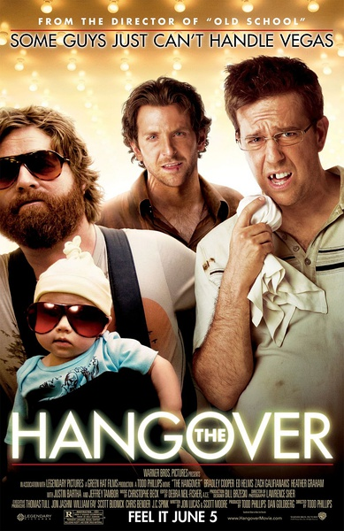
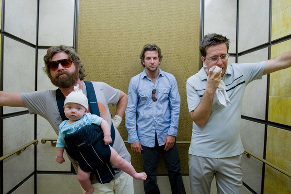
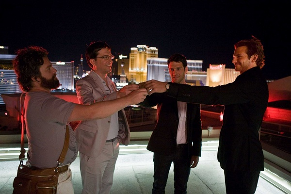

《宿醉 The Hangover》

			

老公的评论：

　　老婆大人看这部电影的时候笑得很开心，这就够了。虽然我还是觉得《宿醉》的笑点有些刻意，但这应当就是时下的潮流，我感觉这部电影要是被翻拍成中国版的，应该会很卖座。

　　参加过一次同学的“单身聚会”，虽然玩儿的也很疯，但是还是比不了这部电影里的主人公了，富人、黑帮、警察、赌场……，他们几乎把一切能够得罪的都得罪全了，如果从闯祸的角度来说，也算是到了一个极致了吧。

　　开始还以为新郎是主人公，结果发现真正的主人公是他的三个朋友，也算是编剧用了心了。最后的结局收尾收的不错，车的问题解决了，又有了八万块赢来的钱，结婚嘛，原本是要喜剧气氛更浓一些的。

　　《宿醉》还有两部续作，不知道会有怎样的变化，期待看过之后再做评论……

老婆的评论：

　　多轻松的一部电影，很搞笑，带给我很多的快乐。

　　虽然，我觉得这部电影整个合理性值得推敲一下，可是有什么关系呢？看的不就是热闹嘛？反正这一夜他们要多荒唐就有荒唐。

　　拉斯维加斯，从很多的影视作品中，我总结这像是美国很多人一生的梦想，就好像某些信徒一生中要去朝圣的圣地。

　　道格结婚前的单身夜，决定和菲尔、西德和小舅子阿兰去拉斯维加斯度过，因为喝了阿兰放的迷奸药，醒了后三人什么都不记得，并且把新郎道格给丢了，整个故事，在讲他们寻找线索找新郎，顺便找回他们那失去的记忆部分。

　　还好，他们赶上了道格的婚礼。

　　诶，那第二部要拍什么呢？

上映年份 2009							
		
http://blog.sina.com.cn/s/blog_52187ba90102vpe9.html
