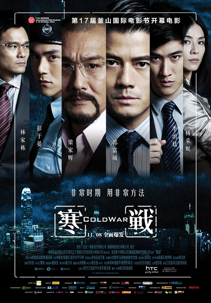
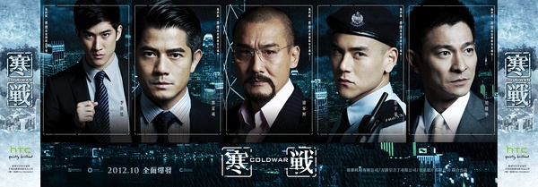
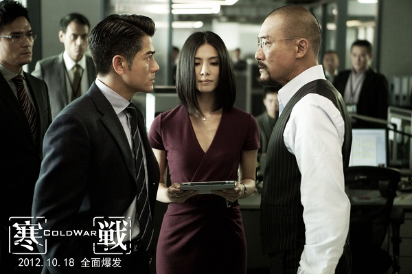
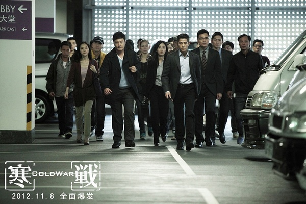

《寒战》

			

老公的评论

 

　　老实说，这部电影我没有看懂，结尾部分的小插曲到底是说李Sir是内鬼或者不是呢？是这一部的终结，还是为了下一部的开始呢？
 

　　不过没关系，看这样一部节奏紧凑的电影，我会有各种猜想，不过并不一定要强求一个结果吧，有续集说明，更好，没有，也就这样了。
 

　　说到节奏紧凑，我觉得这是文艺作品吸引人与否的关键，哪怕是个相声，一分钟一个包袱，才会真的吸引人。《寒战》让我有耐心看完，主要就是没有任何累赘的铺垫，切入主题很快，剧情发展的更快，不知不觉之中，整部电影已经演完了。
 

　　除了剧情之外，感觉梁家辉真的是又老又丑了，还用了这样的发型和胡子，和原来的他真的完全不同了，难道人老了都要变成一个完全不同的形象吗？
 
　　彭于晏没有一边嚼着两粒益达一边演戏，真是可惜，呵呵。
 
　　对了，还有一点也没有看懂，林家栋扮演的角色在天台上的那幕戏到底要说明什么呢……，很激烈，但是不知道和主题的关系。

老婆的评论：
 

　　结尾时刘杰辉（郭富城饰）接到的那个威胁他家人要求他释放李文彬的儿子（彭于晏饰）的神秘电话，虽说没有把那个坏蛋交代出来吧，但好像一下就把这部电影拉升了不少，我猜这个幕后的策划人还是李文彬（梁家辉饰），之前我就怀疑他，但编剧就非要编的与他没有关系似地。
 

　　整部电影节奏还是挺紧凑的，一开始就把我带入一种谁都有嫌疑，谁都有可能都是这次幕后的策划者？然后发展到抓了李文彬的儿子，好像一切都解决了似地，又来了一个大转弯，当上处长的刘杰辉接到了神秘电话，其实到最终那个策划者还逍遥法外呢！
 

　　看电影时，当匪徒要求把赎金改变，然后因为钱嘉乐的话安排5000多万要退回金库，我就觉得匪徒动了这笔款的心思，为什么刘杰辉不多派点人保护呢？当局者迷额。

          最后的那个神秘人是不是梁家辉演的李文彬？

 
上映年份 2012							
		
http://blog.sina.com.cn/s/blog_52187ba90101913y.html
