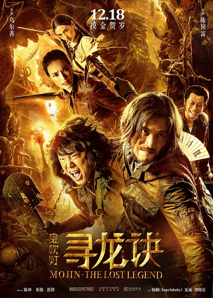
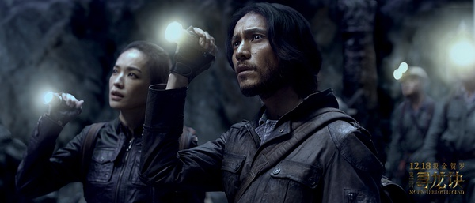
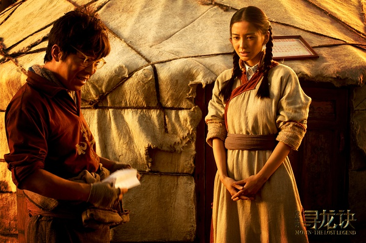

《寻龙诀》

			

老公的评论：

　　第一，没觉得这部电影真的比《九层妖塔》好多少，除了舒淇比姚晨要禁看以外……，第二，不知道是不是剪辑的原因，有些剧情衔接的有点莫名其妙。

　　并没有看过《鬼吹灯》，所以也没法和原著比较。不过即使看过一些电影的原著小说，我也愿意把电影当做一部独立的作品、最多是同人来看待，毕竟小说和电影是两种不同的表现形式。

　　陈坤、舒淇、黄渤在这部电影里的扮相真的是不错的，都体现了各自的特点，但是夏雨的扮相和对白不能说不好，但确实不是我喜欢的，太过于做作。刘晓庆也算是一个另类的“奇迹”吧。确实显得比她实际年龄要小，不是说化妆，而是说整体感觉，老演员确实有功底。

　　我们其实很喜欢灵异题材的文艺作品，但这部电影有一个点我没想明白，如果那颗陨石只是让人产生各种各样的幻觉的话，那些僵尸和日本兵到底是幻觉还是……，这个可能是没看过原著所以有点理解不了吧，或者电影并没有告诉我，为什么古墓之中会有僵尸，僵尸到底是一种什么样的生物……

　　摸金校尉是个挺不错的概念，觉得天下霸唱是个很厉害的作家……

老婆的评论：

　　这部电影，我最好奇的是，那个墓地是如何建成的？很大很深很壮观，在千年前，没有高科技的情况下，得花多少精力和费用来完成？古人的智慧让人向往啊。

　　胡八一（陈坤饰））、王凯旋（黄渤饰）和Shirley杨（舒淇饰）那个摸金团伙本打算金盘洗手，又有人请他们去盗墓，而阿凯发现对方有初恋女友丁思甜（杨颖饰）死时的彼岸花时，坚决接下了这个活。

　　故事就在发生进入墓地里，进去的人在中毒，火烧，产生幻觉各种情况下渐渐的少了，最终只有那四个主人公出来了。

　　额，现在的化妆技术真厉害，陈坤化妆后的样子真是一点都不像他本人。

没想到她是刘晓庆

上映年份　2015　							
		
http://blog.sina.com.cn/s/blog_52187ba90102weil.html
