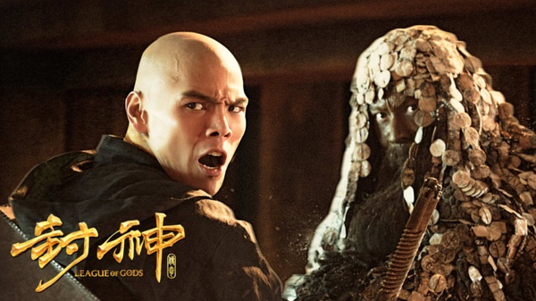

《封神传奇》

			

<b>老公的评论：</b>

　　这部电影中，除了飞船的部分让我感到很无语、找太乙真人没有让徒弟哪吒去之外，其他的剧情部分都还挺好的。

　　《封神演义》对于我这个年纪的中国人来说应该都是知道一些故事情节的，明明是两军对垒却变成了寻宝的RPG游戏，似乎有问题——但是谁知道呢，也许历史上的周朝灭商就是一个RPG游戏式的呢！

　　不得不称赞一下的是向佐在这部电影里的扮相，看了这部电影，觉得向佐即使是不依靠他的父亲，也可以成为一名成功的动作明星。这部《封神传奇》中向佐光头的造型把他的阳刚和略带一些诚挚的感觉表现的很充分。

　　另外值得一提的是这部电影的特效，虽然已经快变成动画片了，但我觉得魔幻电影本当如此，不用这么夸张的特效，怎么能看出是魔幻？

　　李连杰在片中所扮演的姜子牙返老还童让我又看到了《少林寺》中的觉远，不禁唏嘘时光荏苒啊。

　　另外还有就是雷震子和哪吒在天上飞，杨戬在地上跑的情景挺有趣的，杨戬难道连飞都不会吗？哈哈，以后怎么斗悟空啊……

<b>老婆的评论：</b>

　　我想说，这部电影的明星阵容够强大，场面也宏伟，甚至在后期制作上也花费了心思。可是在我看来，这应该是每部电影的前传，而不是像现在一样，电影情节才刚刚展开，就已经结束了，又留着拍下一部呢？难道导演没想过，如果这部不好看，下一部的收视率就会降低吗？

　　我好奇为什么电影的名称叫封神传奇？要我想的话，就封神传奇前传更合适点。或者叫雷震子（向佐饰）的寻找之旅。哈哈

　　没想到向氏父子长的如此的一样，一看就知道是亲生的。

　　妖妃妲己（范冰冰饰）的九尾，我看着设计的差点意思。

　　最后代表光明的武王这方连地拔起的城，让我感叹，现在的编剧编故事真容易，科幻元素随便就能拿来用用，那座城岂不是一座大飞船，当然之前已经出现过了很多的小飞船。甚至现在的元素，也可以随意的植入到这部古装的魔幻剧里。

上映年份：2016							
		
http://blog.sina.com.cn/s/blog_52187ba90102x0op.html
