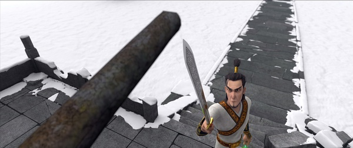

《小门神》

			

老公的评论：

　　本来因为不喜欢为这部动画片配音的某位，所以没打算看，但是好友同领地觉得这部动画片不错，正好有机会聊到了神荼、郁垒，所以被他推荐，就找了来看看！

　　看过之后，觉得这部动画片真的很棒，不仅把中国传统文化融入到了神人共处的场景之中，而且剧情紧凑，成熟之中充满着童趣。

　　在此，我建议没有看过这部动画片的朋友一定要看看，剧情方面我就不多说了。我想说的是：如果把这部动画片翻拍成一部电影，特效好一些的话，绝对是一部真正的中式魔幻片，而且是有经典可寻的大片！

　　赞一下编剧和制作人员！

老婆的评论：

　　看来这又是一部贺岁片，所以片子很热闹，结局很美好。

　　神界经济萧条，土地公公，门神神荼和郁垒都面临失业的危险，他们接受神界的再就业培训，而土地公公被再就业培训中心的老师嫌弃了，被宣布直接下岗，土地公公感叹着，年祸害人间时，神仙们的日子如何的不同。

　　郁垒决定去人间把年给放出来，这样他们就要担心工作问题了，到了人间他救了小镇上的一个叫雨儿的小姑娘，把自己的手环送给了她。于是神仙和人的联系产生了。

　　郁垒打开了一道封印后，引起的连续不好反应让神荼坐不住了，他也来到了人间，并帮助雨儿和她母亲小英开他们的馄饨店，无意的改变，导致那家没有生意的馄饨店火热起来。所以，我想“改变”也是这部电影想突出的思想。

　　当鞭炮声吓走年时，我想这是这部电影的看点了吧？

　　当然，故事的结局一定会圆满的，神荼和郁垒在神界开起了小吃店，土地公公当了账房先生，年一定是被镇压了。

上映年份　2016							
		
http://blog.sina.com.cn/s/blog_52187ba90102wg3e.html
