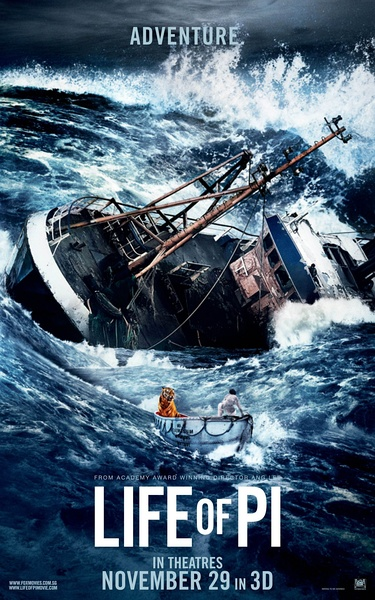

《少年派奇幻漂流 Life of Pi》

			

老公的评论
 

　　这部电影的第一个亮点，出在Pi如何推广自己的名字上，我觉得编剧在这个问题的处理上已经超过了大多数营销公司所做的营销方案，这一点是绝对令人赞叹的。我们现在所处的是一个每一个人都需要个性，每一个人都需要品牌的年代，如何包装自己真的很重要，可惜的是，我觉得大多数所谓的营销人是看不出这个亮点的。
 

　　电影的第二个亮点是Pi所讲的另一个故事，根据这个结尾，完全可以把这部电影想象成一部惊悚恐怖片，至于有多惊悚、多恐怖，完全任由观影者想象，这点真的很厉害，如果Pi的第二个故事才是真的呢？或者他的两个故事都是编的，他只是一个编故事的，这个环节处理的很棒。
 

　　我必须得承认，以前我被电影广告骗过，但是这部电影我是被很多影评给骗了，这是一部可看的电影，但是绝对没有传说中好看。电影的篇幅有点长，而且主要是前面的铺垫太长了，不过说回来，真的很像是什么民间故事的感觉。
 
　　另一件需要承认的事情是文化有差异，我真的不认为我有兴趣去读这个电影的原著，唉，跨文化的理解，真的很难！

老婆的评论：
 
　　曾有一段我都要看不下去了，撑过前面的半个小时，电影才有的看。
 

　　一个好的故事，或者说一个能吸引人一直往下看的故事，开始真的很重要，这部电影的开局不好，情节展开的太拖拉，以至于我很没有耐心。
 

　　其实对于这部电影来说，要看的就是那段在海上漂流的故事，而故事的主人公是派和一个老虎，真的很奇怪，在最后他们居然相处的不错，在这段过程中，我一直说为什么派不把老虎赶下海里去呢，后来想想，一个人在海面上这么漂流，还是有只老虎陪着比较好，他们到岛上那段虽然很短，但我觉得这才算奇幻部分呢。
 
　　再想说的就是主人公派讲述海上冒险故事的两个版本，要你你会相信哪一个？

派把什么都搬到这个很不结实的小筏上，一个浪把水和饼干都带走了
上映年份 2012							
		
http://blog.sina.com.cn/s/blog_52187ba901019j83.html
