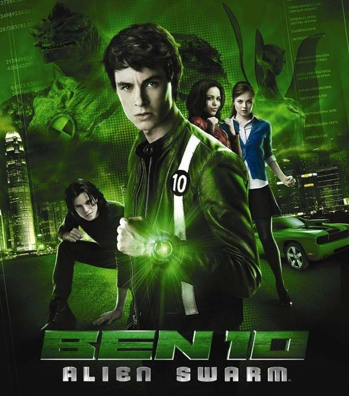
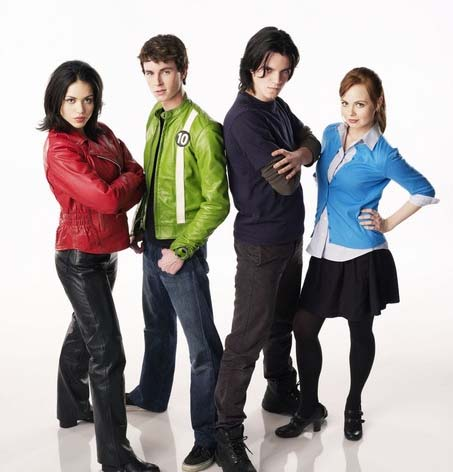

《少年骇客：异形群体 Ben 10:Alien Swarm》

			

            
老公的评论：

　　因为喜欢科幻而选了这部电影来观看，看过之后，觉得这部电影的故事很简单，但剧情却绝不枯燥。

　　我觉得这部电影的角色设计的很好——几个年轻人，银河警察的后裔，具有了一系列的特异功能，可以随意地变身——太伟大了，这个电影中的角色绝对有可能成为新一代年轻人偶像。

　　虽然我已经不再是属于冲动的年纪了，但我依旧很希望拥有一块主人公BEN的表，那块可以让你随意变幻成各种生物的表，真的太厉害了。因为这种具有绝对诱惑力的道具情节，所以让这部电影的其他剧情被我忽视了，什么外星人入侵地球，怎么控制人类啊，又有什么关系呢，哈！

　　最后说一下那种外星昆虫，看着很像蟑螂和“臭大姐”的结合体。

　　谁能告诉我“臭大姐”在各地的方言称呼都是什么吗？
 
老婆的评论：

　　剧情简单，但很完整。查了一下网上说这部电影属于小成本，这点到是出乎我的意料，感觉特效做的还不错，本的变身还挺像回事的。

　　这4个年轻的演员长相还不错，看电影的时候一直在感慨演凯文的内森．凯斯可以去演吸血鬼，他应该算是很英俊的吸血鬼。演本的演员瑞恩·凯利长的也不错。

　　电影的想法还不错，银河系警察是几个有特异功能的小孩，他们守卫着地球的安全，对抗着外来侵略者，这个外来入侵者像个蜂王似地潜入某人身体，并开始产生很多小蜜蜂，再分别入侵人体，最后都成了外星人的奴隶，这种感觉到挺像外星入侵地球似的。

　　影片整体上来讲说不上精彩，喜欢科幻的朋友值得看看！
 
上映时间：2009
 
演员表

巴里·柯宾 Barry Corbin ....Grandpa Max

瑞恩·凯利 Ryan Kelley ....Ben Tennyson

艾莉莎．戴雅丝Alyssa Diaz
....Elena   
 
内森．凯斯Nathan Keyes ....Kevin E. Levin							
		
http://blog.sina.com.cn/s/blog_52187ba90100qm3r.html
