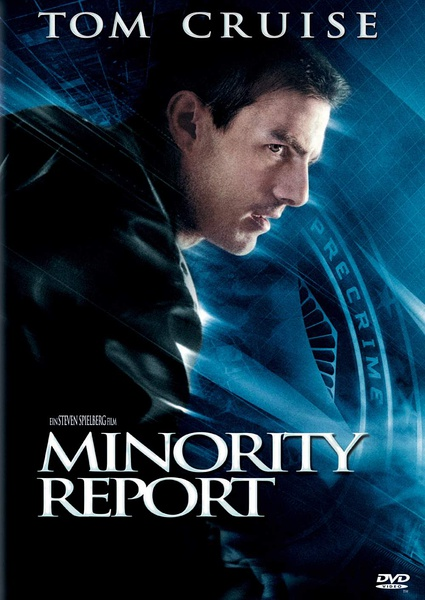

《少数派报告 Minority Report》

			

老公的评论：
 

　　经典的科幻大片，不过因为当年它上映的时候太热了，也至于当年的我认为不该“太俗气”，所以直到今天才和老婆大人一起观看这部片子。
 

　　影片塑造了一个非常好的世界，一个没有凶杀案的世界，从这一个点来看，编剧很有想象力，我们甚至可以想象一下——如果未来人真的有了时空穿梭的能力，第一件事情是不是回到过去去挽救生命呢？这种挽救又会引起哪些蝴蝶效应呢？
 

　　说电影有科幻内涵，并不是说我支持影片中逮捕的方式，在人们还做错事情之前就进行逮捕，从眼下的法律来看，怎么都有不合理的地方。即使是在影片中，克鲁斯扮演的安德顿也是被冤枉的。
 
　　不管怎么说，经典就是经典，即使是十年后再来看这部电影，依然没有太多过时的地方，这点真的很难得。

老婆的评论：
 
　　要是在当年看这部影片，那科技是多让人惊叹，就在今天看这部电影，我都觉得他不过时，大片不愧是大片。
 

　　要是罪犯在企图犯罪之前就能被逮捕这是一件多么好的事情，等到人都被杀了，再去破案对于死者来说似乎已经晚了。科技是可以发展，未来说不定就能实现预知犯罪，但可怕的是人心，就怕他们像本片的拉里似的利用这一系统，谋取自己的利益，到后来甚至嫁祸自己同事乔恩来保全自己。
 

　　先知阿利莎给了乔恩一个信息，乔恩在调查中发现某一案件中，发现只有两个先知资历的存档，并向拉里反应了这个情况……，随后，先知给出了一个预知片段，就是乔恩要杀死某人。
 
　　乔恩一边应付犯罪预防组织的同事追杀着，另一边调查为什么他要杀那个陌生人？这就是故事的高潮部分。
 
　　最终，乔恩证明了自己的清白，而拉里自杀了。犯罪预防组织解散，乔恩又和妻子在一起……

上映年份：2002							
		
http://blog.sina.com.cn/s/blog_52187ba901017hba.html
