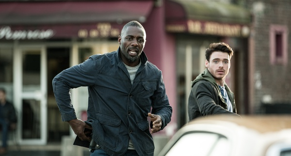

《巴黎危机 Bastille Day》

			

老公的评论：

　　这部电影里面的演员虽然一个都叫不上名字，但是说实话，电影不错。

　　实际上我觉得这部电影如果是好莱坞制作的，再用一些大牌明星的话会精彩更多，毕竟故事讲得是一个CIA在巴黎，没有支援却要对抗巴黎黑警的故事，题材真的很不错。

　　无巧不成书，说的是每一个文艺故事都应当是有很大偶然性的，只不过这个偶然性要让人觉得还可以接受，这部电影就是这样，虽然传奇，但是有他的合理性。

　　在电影一开始的时候，我还以为这又是一个我们不怎么喜欢的低俗片；但是很快神偷一出现的时候就不一样了，这让我们又以为是一个神偷的电影；到炸弹女的出现，让我们以为是一部神偷配合警方破获恐怖事件的电影；谁知转折无处不在，原来还有黑警事件涉及其中……，整体来说，真的可以看一下。

　　细节方面，觉得CIA驻巴黎的那个女负责人死得太莫名其妙了，如果连这都看不出来，怎么当特工呢？

　　许久没有看美剧了，觉得这个题材或许也可以拍一个不错的系列剧吧，可以发生在不同的国度，但依旧是神偷加CIA……

老婆的评论：

　　在我看来这部电影是我最近看过电影中品质比较好的电影，可豆瓣上的打分竟然比《王牌贱谍：格林斯比》的分数低，好奇怪。

　　迈克尔·梅森（理查德·麦登饰）应该是一个成功的小偷，也是一个很有策划能力的小偷，为了吸引开别人的注意力，居然想出裸体美人的招，很厉害。可惜，偷错一次，导致他在未来的这段日子里，要不是被警察追捕，或者又是被黑警追杀。

　　那些黑警们也够厉害的，能想出那样一个法子，偷银行的钱，大伙一起分，真行。

　　再完美的计划，可他们遇到了一个做事认真又有点任意妄为的美国中情局特工肖恩·布瑞尔（伊德里斯·艾尔巴饰），注定了他们不能成功。

　　看多了阴谋的东西，我觉得我已经有点被感染了。

上映年份：2016							
		
http://blog.sina.com.cn/s/blog_52187ba90102x0oo.html
