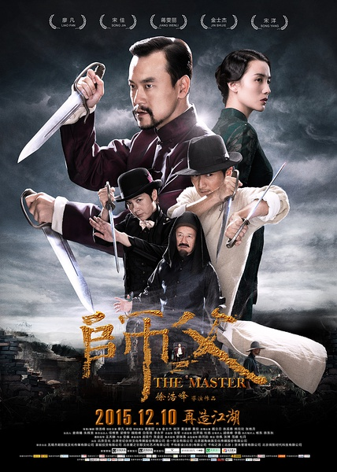
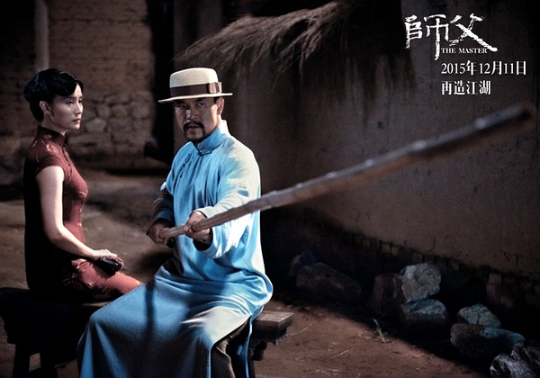
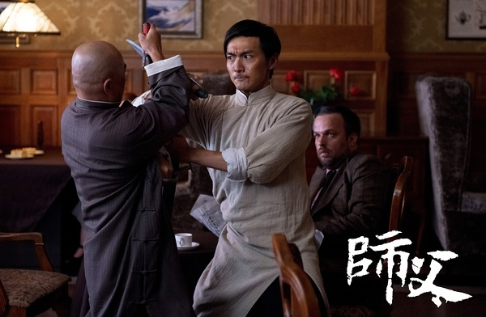

《师父》

			

老公的评论：

　　看这部电影是听人介绍的，但看过之后真的感觉一般，用老婆大人的话来说：“这部电影怎么像是王家卫拍的——每个细节都很清晰，但是整合在一起完全不知道这部电影想要表述什么……”，我的感觉和她完全一致。

　　在这部电影的背景资料中，有两个挺有趣的概念：一是这部电影是根据某某获奖小说改编的；二是这部电影中所展示的都是硬桥硬马的“真功夫”！说这两个概念有趣，一是因为小说好并不一定代表电影好，并且一部电影的好坏和小说原创其实没什么关系，反而是和编剧、导演、演员的关系最大；二是看电影不是看武术表演，只要好看就够了，是不是真功夫真的没那么重要！因为电影本身是“假的”。

　　廖凡曾经也是混过帅哥的，不过在这部电影里的扮相真的有点猥琐；宋洋是为不错的帅哥，所以就要被写死吗？蒋雯丽怎么装酷都不像打星，这个角色我觉得选的有点问题……；宋佳的扮相还是不错的，反正是个花瓶主妇，也就这样吧！

　　最后想说的是见到了陈观泰，老了，唉，这些曾经的明星老了，自己也老了……

老婆的评论：

　　我以为这部电影远没人说的那么好。

　　我还在想，这部电影最终说明了什么？或者到达想表达一个什么样的中心思想？还是我道行浅，其实演出来，只是我没看懂而已。

　　但有一点，我不得不承认，这部电影在动作方面，可算的算是大片了，在打的动作和场面上都是下了功夫的。

　　南派咏春传人陈识（廖凡饰）来到天津，为了报师门，想开武馆教授弟子，可在天津开馆有很多的规矩，他从武术泰斗郑山傲（金士杰饰）下手，而后娶了赵国卉（宋佳饰）为妻，还收下了本地青年耿良辰（宋洋
饰）为徒代其踢馆，这些策略是好，可惜变化也多。弟子得死好像让他懂得了些什么。
　　

　　最终的结果他杀了军界人士林希文（黄觉饰）为弟子报了仇，而他只能逃出天津回广东去。实际在这逃走时，我有一种感觉，陈识当不了一代宗师，他好像缺了点气场，阴谋也多了点。

上映年份　2015							
		
http://blog.sina.com.cn/s/blog_52187ba90102wf0b.html
