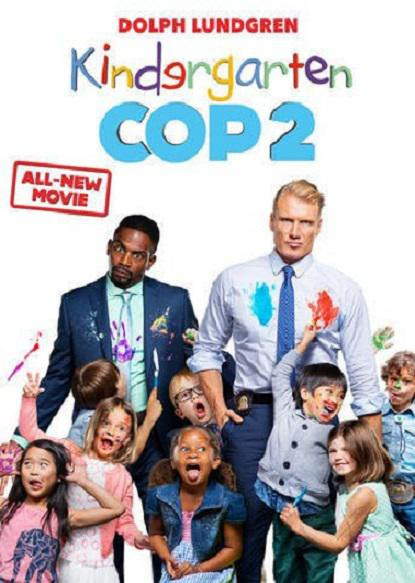

《幼儿园特警 2 Kindergarten Cop 2》

			

老公的评论：

　　对比之前看过的《暴动》中的杜夫·朗格，这次的警察扮相显得年轻了许多，不能说是个中年人，但是绝对不像一个60岁的老爷爷。

　　同样是怀旧题材，同样是续集，为什么年轻的《超级名模 2》就没有《幼儿园特警 2》这种感觉呢？

　　说起来，《幼儿园特警
2》中的桥段并不是真的很搞笑，也不是真的那么温馨，更没有因为发生在幼儿园就增加了许多天真烂漫，但是，这样一部电影，在不知不觉中也就看完了。

　　我觉得故事的结尾部分略微有点仓促——持枪的匪徒怎么会被一群五六岁的小朋友打得不知所措呢——能持枪挟持警察，难道不能挟持一个小朋友作为人质？

　　其实这种电影是比较难以评价的：已经忘记了前作的内容，所以没有感情因素；打斗不精彩，所以能不能算动作片；笑点不够强劲，所以也不是喜剧片……，老实说，一部这样的生活片能让我看完，其实不容易。

　　可看，不过“续作不如前作”的说法依然成立，可能是电影、电视剧越看越多吧，总觉得精彩的、好看的越来越少。

老婆的评论：

　　才看完杜夫·龙格尔演的在监狱中卧底的《暴动》，又看他演幼儿园老师，其实，有的时候，我很怀疑，导演为什么会选一个年龄有点大的人，来演幼儿园老师的卧底？

　　看着一个毫无经验的人，要当小朋友的老师，也是一件非常艰辛的事情，看着他慢慢的和小朋友相处出感情，又很感动。

　　其实这虽然是一部虽然是卧底的影片，但整部电影展现的人与人之间的温馨的感情故事，当然最后案件也破了。

　　所以这部电影还能看。看的时候很轻松！
上映年份：2016							
		
http://blog.sina.com.cn/s/blog_52187ba90102x0vt.html
