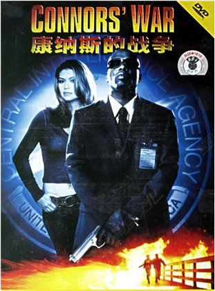

《康纳斯的战争 Connors' War》

			

 

老公的评论
 

　　这部电影的片头真的是很精彩的，特工Connors独闯龙潭，在众多绑匪的的环伺之下解救了美国第一夫人。在我和老婆大人只看开头就放弃了《我爱香港》、《宇宙大爆炸》这两部电影之后，这个片头让我们振奋了一下，觉得这应该是一部不错的电影。
 

　　如果说随着剧情的发展，我们两个开始不满，那是撒谎，我们没有什么对剧情不满的，而是看着看着就犯困了，虽然我们爬过了香山才回家看的这部电影，但是身体的疲惫绝对不是我们打瞌睡的唯一理由。
 

　　老婆大人对这部电影一句话评价很经典：“这部电影就是讲这个小黑治眼睛的吧！”好好的一部动作片，被我们当做医疗片来看，唉！
 
　　听说主演是个街舞明星，片子里也没看到他的身段，总觉得有些遗憾了！
 

老婆的评论：
 

　　电影的开头还挺精彩的，我劲头十足想把这部电影看完，结果还没多一会，我就被催眠了，我基本上是在一半清醒一半睡着的状态下把这部电影看完，说实在的我很少看电影的时候睡着，这部电影就是其中的一部，可想而知，是多么的无趣。
 

　　这部电影都不知道讲的是什么，两群特工谁好谁坏到头来我也没有看出来，康纳斯扮演的这个角色也很奇怪的，他的老板手下这么多人，居然派康纳斯这个瞎子去偷东西。
 
　　建议大家可以不用看这部电影了。
 
上映年份
2006
 
导演
Nick Castle
 
主演
Connors……Anthony  Criss							
		
http://blog.sina.com.cn/s/blog_52187ba90100ucko.html
