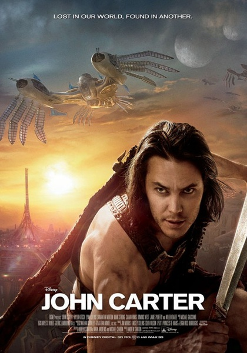
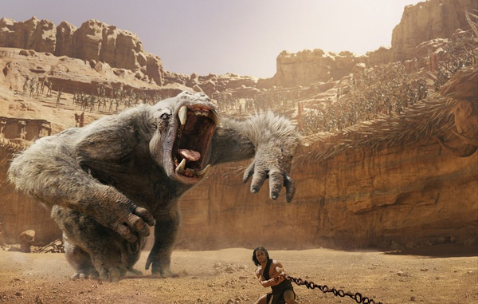
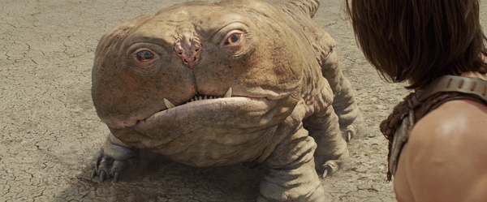
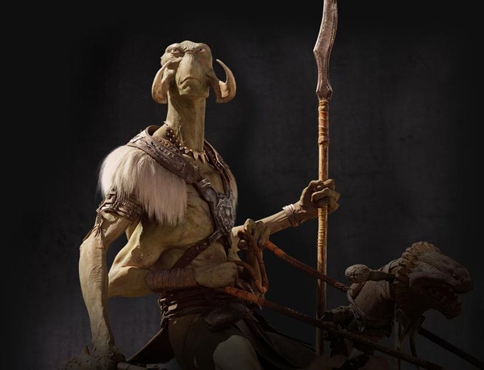

《异星战场 John Carter》

			

老公的评论：
 

　　看过了开头之后，差点放弃了，这部片子的感觉太老旧了，不过随着耐下心来跟着主人公一步步地走进剧情，觉得还是一部可看的电影。根据科幻小说名著而来的科幻电影看点总是会多一些。
 
　　让我最喜欢的，是这部电影的结尾部分，这种感觉让我觉得这部电影不是一部卖特效的动画片，多少还是有点情节的。
 

　　男女主人公的爱情显得和剧情有些脱节，但是那只很像中国墓葬品“石虎”的宠物实在是太有意思了，又可爱，又好玩，和大人真想弄一只来养着。
 

　　说到科幻，恐怕现在不会有人再觉得火星上会有和地球类似的生命了，不过这不妨碍这部电影属于科幻的范畴，毕竟在原著产生的年代，科技还是没有现在这么发达的，那个时候人们幻想火星生命就如同现在的人幻想平行宇宙或者多维空间一样正常。
 
　　感觉这部电影是可以拍剧集的，因为那三位女神使者还有一位活着，在火星上，而主人公又回到了火星，战斗看来是难以避免了。
 
　　真心希望更多好的科幻题材被搬上大屏幕，当然，比这部要好才行！
 

 
老婆的评论：
 

　　哈哈，我把扮演John的泰勒·克奇认成了《杀手:代号47》的男主人公的扮演者蒂莫西·奥利芬，我一直比较满意的图像记忆需要进行补丁修复了。老公前段时间说我说的话，总有点颠三倒四的经常不知道我在说什么，大家看我写的东西是不是也有这种感觉？
 

　　不知道各位怎么看这部电影？反正我非常的喜欢这部影片，尤其爱那个火星小怪物乌拉，他简直是为我量身定做的小宠物，又能保护主人，又跑的这么快，又能懂人话，最重要的是他如此的憨，如果可以，我也想去火星，在那可以跳着走……。
 

　　至于电影的情节，整体上我觉得设计的还行，最后结局处理的相当不错，在火星上发生的一切让回到地球的John想尽办法的要回火星去，而设计了一个小阴谋让看护者现身抢到了通行证。
 
　　额，这部电影里设计的飞机挺逗的，感觉上很怀旧。

                      
仔细看‘乌拉’长的可不怎么好看，不过对于我来说他够憨的。

                                
火星怪人与他的坐骑
上映时间：2012年							
		
http://blog.sina.com.cn/s/blog_52187ba901011mcs.html
