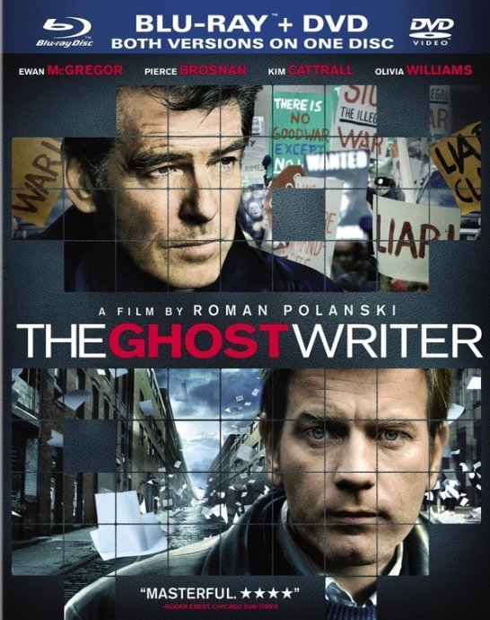
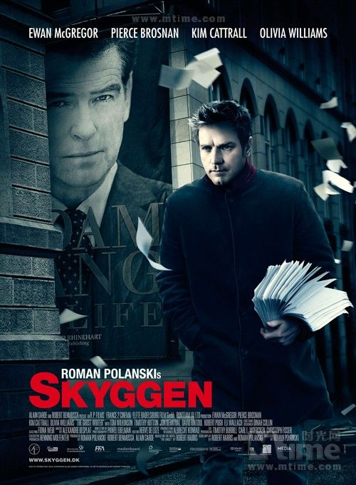

《影子写手The Ghost Writer》

			

老公的评论：
 
　　因为一向对政治很不感兴趣，所以当发觉这部电影是讲政治斗争的时候，热情消失了不少。
 

　　总的来说，我和老婆大人观点一致，觉得影片中的这个影子写手太不称职了，他是被自己的好奇心害死的，为什么要当写手呢，去当侦探多好！
 

　　其实，对这部电影而言，我觉得有很多细节是很难被我接受的，第一就是已经提到的写手不务正业，不写作而去查案；第二就是一个前首相夫人，居然轻易地就和写手上床，真不知道这到底是什么感觉和行为，什么样的社会？第三就是对美国势力的夸大，CIA真的有这么强劲的实力吗，强到可以控制英国首相夫人，那这个世界太可怕了，还什么多元化，美国一个国家玩儿得了。
 

　　看了这部电影之后，我甚至觉得08年的经济危机都是美国故意搞出来的，什么美国经济衰退都是假的，甚至我们从电视上看到的任何关于美国的报道都是美国干扰了通讯信号或者网络而让我们看到的虚构的影像……，呵呵！
 
　　唉，主人公干嘛那么傻？唉，要是有人花25万找我写书就好了……
 

 
老婆的评论：
 

　　这部影片我总是记不住叫什么？而且也一直觉得叫《影子写手》好像不怎么贴切，老公说字面的意思《鬼写手》，这个名字我到更能接受一些，那个写手不就被撞死了吗？
 
　　其实最近这两电影都没太看懂最终电影想表达什么意思，虽说是这样，但也不影响我觉得这部影片还不错。
 

　　真是好奇害死猫。看完这部电影我仅有的一些好奇心都被扼杀了，这写手就因为那点好奇，追查一个信息，本来没有他什么事，他好好做好本职工作就好了，他很不想卷进斗争中，但自己就非把自己给挤进去啦，这点我很不理解。而且他和客户的妻子发生一夜情真不应该。
 
　　总体来说，故事的结构还行，剧情的推进也还行，还有皮尔斯·布鲁斯南的加盟，值得一看。
　　是啊，让我老公写书多好！25万人民币就好！！							
		
http://blog.sina.com.cn/s/blog_52187ba90100wg7g.html
