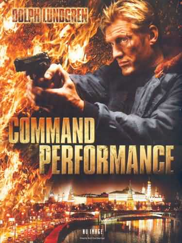

《御前演出 Command Performance》

			【夫妻影评】《御前演出 Command Performance》

 
老公的评论：
 
　　一部非常传统的美国英雄式的动作片——俄罗斯特工及部队都无法解决的事情，由一个美国的摇滚乐手解决了。
 

　　杜夫·朗格是一个我不讨厌，但也谈不上喜欢的演员，知道他是一位动作明星，也知道他一直缺乏走到顶尖行列的机会，印象深刻的恐怕是他在《敢死队》里的表现，怎么感觉他在这部电影之中要年轻了许多，只差了一年啊！
 

　　影片中的俄罗斯总统，有一些普京的风范，挺有意思的，不过B级片总是要受一些限制的，比如电影中俄语与英语的混用处理的就很不好，没道理俄国人之间交流用英语吧……，不过无伤大雅！
 

　　看着杜夫·朗格，不禁感叹年华的老去，好像不止是香港电影，世界电影圈也进入了这样的怪轮回——由于老一拨影星太过红紫，导致新人很难冒出头来！拿动作片来说，巨石、斯坦森、克里夫·欧文……，还是无法比的上前辈们的成就，让人记忆深刻的角色仿佛也少了许多。
 
　　在以前，看一部电影，哪怕是一部动作电影，也总会有一两句对白流传很久的，现在呢？
 
　　希望好看的电影继续不断地涌向，我们才能一直活得欣赏的快乐！
 
老婆的评论：
 

　　总觉得美国的影片够能想象的，他们设计的电影把俄罗斯搞进去，甚至当俄罗斯的总理被人绑架，需要美国的摇滚鼓手营救，这也是典型的个人英雄主意。
 

　　前段时间才在《敢死队》中看过杜夫·朗格的演出，这次硬汉加上了艺术家的形象的包装，让杜夫·朗格过了一次艺术家瘾了，这种形象还挺酷的。
 

　　整部影片来说，并没什么特别的东西，剧情非常的简洁，杜夫·朗格演绎的鼓手在俄罗斯总理来观看演出中，出现了一队有组织的坏人，见人就杀，杀死美国大使，绑架俄罗斯总理及其女儿，在紧急时刻鼓手发挥了必要的重要，把这些人一一解决了，终于里应外合成功的救得了这些人的性命。
 
　　这部电影，可看！

上映年份2009
 
导演
杜夫·朗格
 
主演杜夫·朗格							
		
http://blog.sina.com.cn/s/blog_52187ba90100o2pb.html
