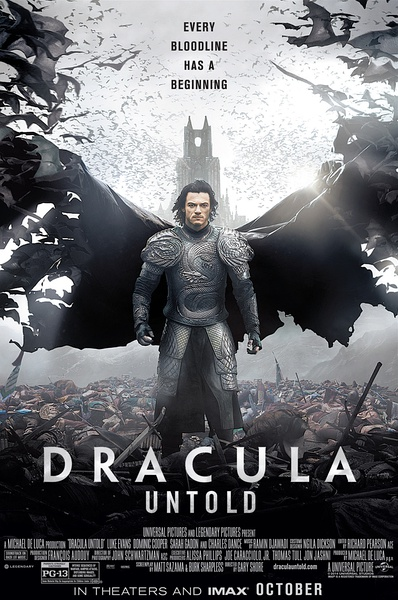
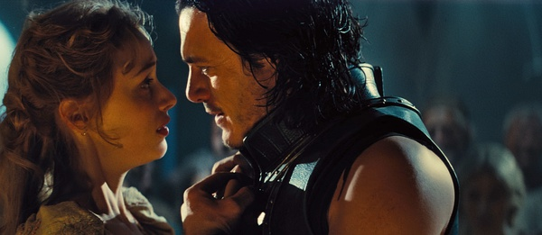
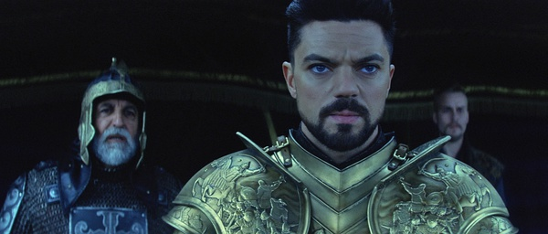
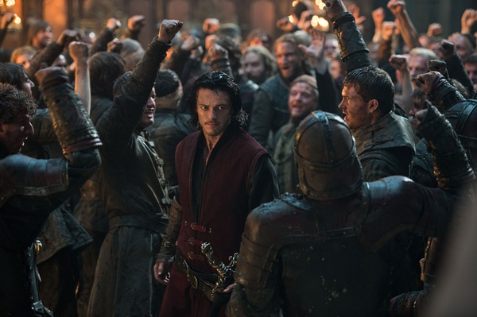

《德古拉元年 Dracula Untold》

			

老公的评论：

　　看完这部电影之后，很期待“环球怪物宇宙”系列电影了。只是希望西方人在制作这些电影的时候能不能也考虑一下中国观众，找几个中国传说中的“怪物”来拍一拍。

　　我们两个一直很喜欢灵异题材的影视作品，吸血鬼无疑使非常受我们关注的主题。这部电影在吸血鬼的题材之外，又加入了亲情的题材，更为酷的是加入了“王子”一个人单挑土耳其整支部队的桥段，这种感觉真的是太有趣了。

　　如果“王子”变成吸血鬼代表着德古拉元年的话，那么山洞里的那位又是谁呢？已经拍到现代了，不知道这部电影如果出续集的话，会怎么编，我个人倒是觉得不必拍续集了，继续拍别的怪物才是保证质量的正解。

　　吸血鬼的故事越来越多，想要不雷同越来越难了，期待更好的题材与更好的演绎！

老婆的评论：

　　原来吸血鬼是这样来的，这么喜欢吸血鬼，总算是看了一部关于吸血鬼来源的影片。

　　看完这部电影，我更喜欢这个版本的德古拉，弗拉德王子为了他的国家和他的孩子，做出了选择也做出了牺牲，谁能说这种选择有什么不好呢？不知道他忍受了那三天不喝血是什么状况？其实他已经做得很好了，是一个意志力坚强的人。

　　侵略者总是很邪恶，土耳其军队比德古拉的蝙蝠还邪恶。

　　弗拉德王子在杀死穆罕默德的军队，救出儿子以后，他释放太阳光，把他转换的吸血鬼包括自己都杀死，他是真正的勇士，值得我钦佩。不过，他被他的仆人给救了。

　　故事的最后德古拉来到了现代，他遇到了他的爱人，那个来世再相爱的女人，不太美好的是，那个洞里的吸血鬼也跟在后面，还说游戏又要开始了，看来为下一季做好准备呢。

　　我喜欢这部电影，很好看！

最终侵略者要付出代价的

上映年份 2014							
		
http://blog.sina.com.cn/s/blog_52187ba90102vfjg.html
