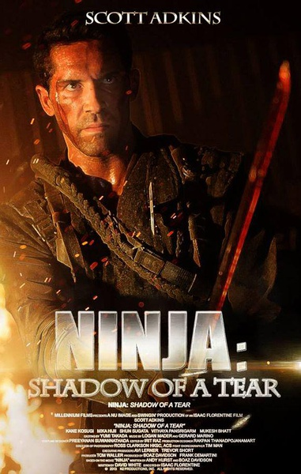
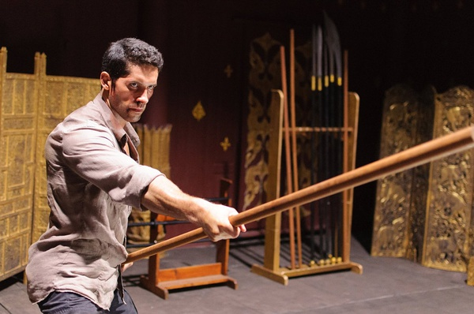
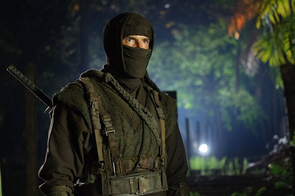

《忍者2：泪影 Ninja 2: Shadow Of A Tear》

			

老公的评论：

　　《忍者2：泪影》的前作并没有给我留下什么印象，所以这部电影虽然并不是很新了，但是我也一直没有看的想法，最近看电视剧实在是看累了，才找到了这部纯粹的动作片。

　　对于这样一部以复仇为主线，从头打到尾的电影，我觉得评论什么的真的意义不大，因为电影的故事太简单了。

　　在看电影的时候，老婆大人说这部电影里面的打斗很像老港片，我深有同感——没有太多夸张的特效，有的只是关于打斗动作的精确的设计，再加上主人公孔武有力的身段，看这种打斗要比那种动不动就飞上几百米高，一出手山崩地裂的要更是像电影而不是动画片。

　　另一个不想评论太多的原因是忍者毕竟是日本的东西，没必要评论太多。

老婆的评论：

　　这电影很简单，就是好好的欣赏他们打架的动作，这些动作设计的很逼真，打架很有味道。

　　人生最可悲的事情之一，情深时失去了自己的另一半，还是最好的朋友做的。最悲剧的事情之二，被自己最好的朋友设计去杀人。凯西，你能更惨点？看来越优秀的人，脑袋越得好使，不然该成为另一个凯西了。

　　我是在五郎问凯西是谁的时候，才知道，五郎并不是杀奈美子的人，你不能不知道自己要去杀的人长什么样。而一些电影的片段如五郎的兵器，如五郎做事的风格故意引导观众五郎就是凶手。我想这些安排只是为了在揭露真正凶手时，让观众有恍然大悟的感觉。

　　看来那条寓意祝福美好的项链，其实是诅咒……

上映年份 2013							
		
http://blog.sina.com.cn/s/blog_52187ba90102vqtg.html
