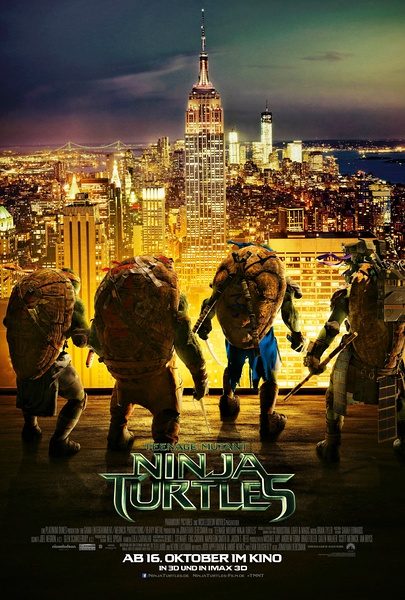

《忍者神龟：变种时代 Teenage Mutant Ninja Turtles》

			

老公的评论：

　　我知道这部电影一定是老婆大人喜欢的品种，果然没错。

　　事实上之前有关《忍者神龟》题材的电影我们一部也没看过，连动画片也没有，因为我没那么喜欢。

　　不过说起来，我对于任天堂红白机的《忍者神龟》游戏，还是觉得挺好玩儿的，那是我在高中时候和马庆松一起玩儿的游戏，我依旧记得我们俩不上课，花了一下午时间去他家打“忍者神龟”，结果还是没能通关，我觉得当时是我比较面，不喜欢这种动作类的游戏，恐怕也是因为游戏玩儿的不好给我留下了阴影，让我也没那么喜欢同题材的电影了。

　　觉得这部电影要是在电影院看会更有感觉一些，特别是在雪山上的那些场景，配上大屏幕，震撼的音效，一定会让感官刺激更加饱满。之前觉得我们家的55英寸的电视已经够大了，但是在最近去过电影院之后，觉得电视还是太小了，怎么也没效果。

　　我记得任天堂游戏里还有一个犀牛怪要打呢，怎么这部电影里没有？

　　小乌龟们的角色设计的都很有趣，让我和老婆大人开始议论我们养的乌龟了，不知道寄样在华英雄家的它们如今安否，进化到了什么阶层？

老婆的评论：

　　作为动作片来看，这部电影还是带给了我很多的快乐，这四只小龟，因为变种实验导致突变，可以说话，可以打架，一个个个性也很鲜明，有意思，最有意思的是他们的老师是一只老鼠，哈哈！看来老鼠的地位又一次得到提升。

　　阴谋，好像在大城市不断上演，因为很多有欲望的人恨不得统治全世界。而要保护这个城市四名侠客竟然是变异后的巴西龟：拉斐尔、列奥纳多、米可朗基罗、多纳泰罗。第6频道女记者爱普尔，她很想成为一个优秀的记者，她无意中发现了变异龟，没想到这是她小时候的宠物，更没想到因为她导致变异龟被抓。

　　看的时候，我有点生气，爱普尔干吗非要和变异龟过不去呢，呵呵，其实最后还不是要一起战斗，阻止了萨克斯与施莱德的阴谋，要给这个城市放病毒，真是坏人中的坏人，最后也没将他写死，哎，又是为了能再拍吧。

四大侠这一家算是聚齐了，又是老师又是守护者

这身装备不错

感觉最近他也挺活跃的

上映年份 2014

							
		
http://blog.sina.com.cn/s/blog_52187ba90102vcxp.html
