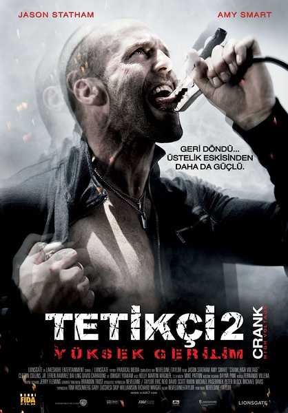
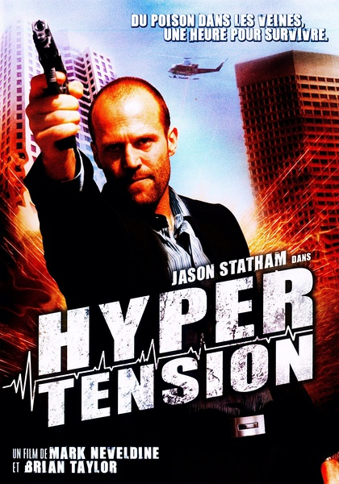
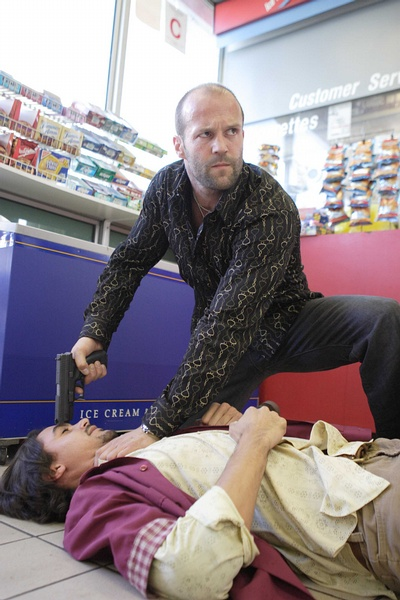
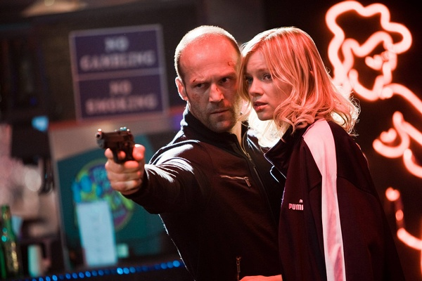

《怒火攻心 Crank 1&2》

			

《怒火攻心２高压电》海报 

老公的评论：
 
　　斯坦森是我们最喜欢的动作明星之一，他的电影隔了这么久才看，感觉有些不够支持他，呵呵，抱歉了，杰森！
 

　　不熟悉这两部电影的编剧和导演，但是从感觉上总觉得这种电影的黑色幽默有点英式风格，虽然切里奥斯是个美式的独行侠，但是里面的笑料真的很冷。
 
　　在看这两部电影的某一瞬间，我忽然想这样的电影是不是也应当算到科幻类呢？真是很奇怪的想法。
 

　　不知道在拍这两部戏的时候，斯坦森到底是怎么想的，他也算是个巨星了，居然出演这种大尺度的电影，太搞笑了！我们两个一直都觉得好电影是不应当“色诱”观众的，但是《怒火攻心》还可以，因为有斯坦森！
 
　　在第一部里面，看到了《美眉校探》里面的Weevil，有熟人，很亲切。

老婆的评论：
 

　　要是去掉里面的粗口和有色镜头，是不是就失去现在的感觉呢？这二部电影整个给我的感觉很神奇和荒唐。不过，电影嘛，的确是应该与常态不同，才会吸引人去看。看的时候也让人惊心动魄，还不错！
 

　　神奇是指主人公切弗是一个神奇的人，第一部他被人注射致命毒物，有一小时的命，他的医生告诉他提高体内肾上腺素的含量才能维持生命，医院抢药，这个被挟持的医生，第二部还会出现的。为了复仇他各种方法维持生命，第一部最后终于与仇人瑞奇从直升机上掉下来。
 

　　第二部的开始就是他居然活着，只是他的心脏被他挖走，换了那个人造心脏，又回到第一部的命运，这次他是需要电来维持生命了，这次他要拿回心脏。
 
　　荒唐的是二部切弗为了维持生命都在众人面前与女友伊芙真人秀表演。还有去高压电上给自己充电等等。
 
　　斯坦森这个演员，我喜欢！

上映年份　2006 2009							
		
http://blog.sina.com.cn/s/blog_52187ba90101fvaf.html
