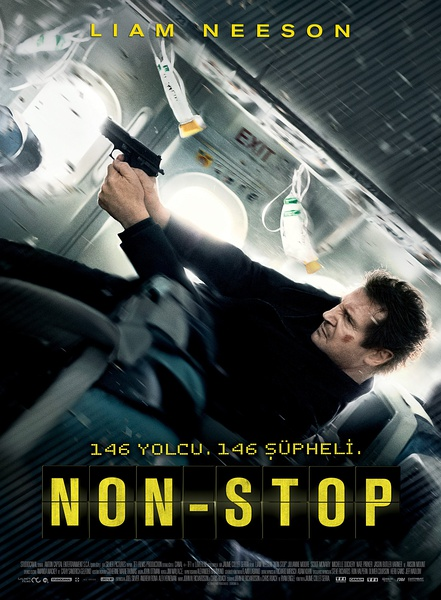

《急速天劫 Non-stop》

			

老公的评论：

　　我一直不喜欢政治题材和沉重的电影，所以我没看过《辛德勒的名单》，我记住利亚姆·尼森是因为《飓风营救》。

　　这个故事虽然很是近似“密室杀人”类型的空间设计，但是加入了主人公被误解的桥段，挺有意思的。

　　从编剧的角度来说，悬念设计的很合理，也很“悬”。我和老婆大人曾经一度认为女主人公是坏人呢，结果不是。

　　刚看完阿诺的《破坏者》，再看一部六十多岁的老人家演的电影，虽然觉得好看，但也为年轻一代的演员悲哀。

　　好像很久没有看到新的好莱坞动作巨星出现了，连斯坦森也奔着五十数了，是不是因为现在电影后期技术太发达，演员本身已经不太重要了？

　　可能看的电视剧、电影太多了，最近我们都陷入了审美疲劳期，希望能有让我们眼前一亮的作品出现！

老婆的评论：

　　这部电影还挺让人紧张的，谁才是飞机上的坏人？这只在幕后操纵的手很厉害。

　　空警Bill的手机上收到未知号码要求他向一个秘密账户转账1.5亿美元，否则就会每隔20分钟杀死一名航班上的乘客。我在想为什么那个操纵者这么厉害？怎么后来的事情都按他预示的在发展，其实想想也有点夸张了但也合理。

　　当然怎么也没想到坏人是两个人，而其中一个还是计算机网络高手，他只是想要钱而已，另一个却是准备搏命的人，可是这样的他为什么上飞机之后不把炸弹给点了呢？可能这是给伙伴期望的。

　　在其他人的眼里，一切都是Bill在操控着，他是嫌疑犯，最后他成为了英雄，拯救了飞机上其他人的性命，当然副机长不配合也不行的。

　　整体上来说，这部电影值得一看。

空姐还是相信Bill的

左边这两个熟脸孔让我们一度怀疑他们是坏人，导演终于让我们意外了。

坏人之一

坏人之二

上映年份 2014							
		
http://blog.sina.com.cn/s/blog_52187ba90102vdiv.html
