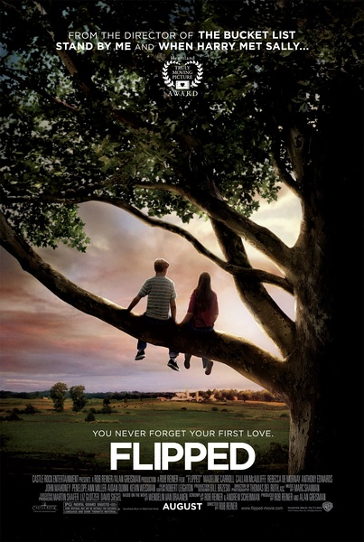

《怦然心动 Flipped》

			

老公的评论：

　　一百分满分的话，无论怎样筛选，我都会在我看过的电影之中给这部《怦然心动》打95以上的分数。

　　在电影开始的时候，我一直以为故事演的是两个小朋友长大之后，甚至我还设计了开始小男孩儿不喜欢小女孩儿，说的是女主角的“怦然心动”，而故事的主要部分将放在两人长大之后，男主人公爱上女主人公，反过来“怦然心动”——结果我真的猜错了。

　　我真的没有想到一部拍摄“青葱”恋情的电影可以拍的这么好。这部电影的主人公虽然是两位初中生，但是这部电影绝对是拍给大人看的。看过这部电影，想着它的题材、剧情、细节……，感觉国内的电影真的差的不是一点半点，保守的说，三十年以上的差距肯定是有的——我真的不明白现在国内的那些电影人为什么还觉得自己那么了不起。

　　其实，电影中让我最震撼的部分是那个有关“篮子少年”的拍卖会——故事设定的背景时间是1963年，某初中——这样的营销模式，即使放到现在中国的大学，也会是一种创新吧！

　　“外公”在电影中的戏份儿并不多，但这个角色却讲述了“素质教育”是怎么一回事，这个老人家设计的很有味道。

　　很遗憾没有在第一时间看到这部电影，也许我不会再看第二遍，但是仅是这一次给我留下的印象就已经足够深刻了！

老婆的评论：

　　看这部电影的时候，我就很感慨，在60年代，美国的家长在教育小孩方面已经很开放了，值得借鉴，培养孩子的动手能力，就如朱丽的课题是鸡蛋培育成小鸡，之后自己养鸡下蛋还能赚零花钱。

　　电影用挺简单的方式，用布莱斯和朱丽俩不同的角度来讲述，这段青梅竹马的感情。另外我觉得他们小学关于拍卖小男生的午饭权，太有创意了，拍卖到可以一起吃饭，看电影等。

　　其实，我觉得这部电影观后感没什么可写的，那些有孩子的家长应该跟这部电影学习一下，学习如何和小孩沟通。

　　小男生布莱斯挺帅的，还带有点腼腆，确实能吸引小女孩朱丽，朱丽在某个时候也觉得布莱斯就像个花瓶。

上映年份 2010							
		
http://blog.sina.com.cn/s/blog_52187ba90102wnnl.html
