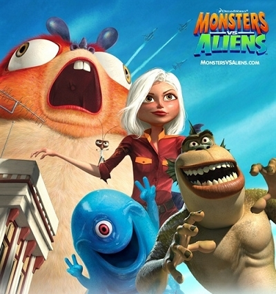
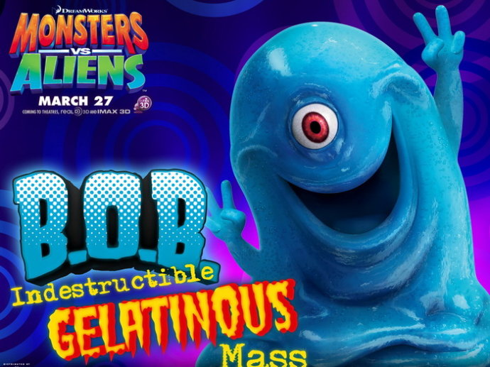

《怪物大战外星人 Monsters vs Aliens》

			【夫妻影评】《怪物大战外星人 Monsters vs Aliens》

老公的评论：
 

　　这一阶段看了大量的欧美剧，所以看电影的时间少了许多，看动画片的时间就更少了，好不容易选了一部，《怪物大战外星人》没有让我们失望，这是一部很棒的动画片。
 

　　我最喜欢的，是里面的果冻怪，这个家伙不但形象怪异，就连思维也很怪异，因为自己没有大脑，所以总是把自己当做别人，把别人的思想当成是自己的。
 
　　片子中的虫宝宝设计的也很有趣，硕大的身躯，居然只有那么小的翅膀，太有意思了。
 

　　蟑螂人？其实我一直奇怪为什么蟑螂没有进化成人，因为他们的生命力太顽强了，比起我们人类来，它们应当更适合在这个星球上生存。
 
　　至于那个猴鱼，我觉得一般，而且他也没有在片子中表现出他的特色来。而那个外星魔王，总是让我想起《海绵宝宝》的章鱼哥……
 

　　看完了美剧《异形庇护所》的第一季，再来看这部《怪物大战外星人》，觉得有类似的地方，或者，这个世界上真的有很多怪物等着我们去发现吧！幻想……，憧憬……
 

 
老婆的评论：
 

　　在地铁的电视上多次看到这部影片的预告片，当时觉得一定要看看，应该很好看。其实，看过之后感觉并不觉得有多棒，相反，我觉得这些怪兽制作的并不是很好，那个幼虫，怎么看都觉得假。
 

　　其实，我也知道就3D影片来讲，对于有些东西并不能要求太多，可把外星人写的那么笨，实在是有点夸张。不过，作为成年观众来说算是对这部影片的一些挑剔吧，我想小朋友在看这部影片时，肯定很开心。
 

　　果冻怪够憨，蟑螂博士够有才，半鱼半猴够搞怪，苏珊够有本事，外星人够傻。不管怎么为保护地球的怪兽他们代表正义的一方，最终赢得了邪恶的外星人，就已经够了。再加上怪兽们为了战胜外星人所做的一切，我想影片就很有看点了，所以，这部影片非常的适合小朋友们看。
 
上映年份 2009							
		
http://blog.sina.com.cn/s/blog_52187ba90100hbj6.html
