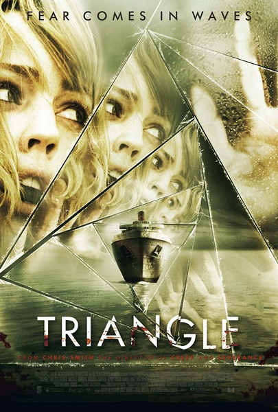
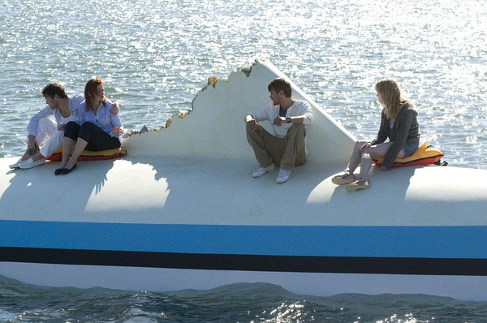
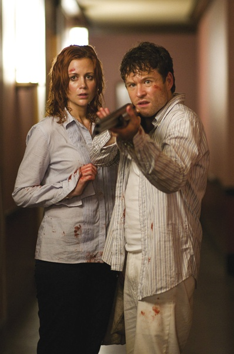
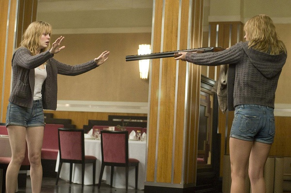

《恐怖游轮 Triangle》

			

老公的评论：
 
　　无意中看到这个电影的介绍，也是讲无限循环的，于是找来了看看，虽然是五年前的，但是还不错。
 
　　事实上这不能算是一部恐怖题材的电影，甚至连惊悚的算不上，更多的是引人思考的谜题。
 
　　这种谜题和那种沉重的人性啊，责任啊题材不一样，就是让我忍不住去思考电影中的“为什么……”。
 
　　主人公Jess本来是先拍的这个电影，但是因为我们没看过，所以反而是在《傲骨贤妻》里先认识的她，长得很有特点的一个人。
 

　　看了一些关于这个电影的介绍、评论，发现这又是一部讲“人死以后的故事”的题材，一个妈妈在死了之后，灵魂并没有放弃去救自己的孩子，于是在尝试着一次又一次的可能……，让我想起了《乘客》……
 
　　我想，如果是在五年前看这部电影的话，会觉得更好看。

 
老婆的评论：
 
　　很难得有电影能催眠我，这部电影就把我催眠了，导致我看完这部电影后去补交去了。
 

　　要是演时间循环的话，那么真没有最近看的《明日边缘》好看，要是真是像导演想表达的那样，是想表达杰西车祸死后的灵魂一直想回到儿子身边，回去的方式很奇怪。
 

　　不过，这部电影的确是很恐怖，杰西不断的杀戮，要不断的杀死上来的人，其中还包括自己，还有片段一个人的不断死后的尸体摆在那，太血腥很恐怖了。

　
　　哎，我觉得这部电影可以不看。

遇到一个熟脸孔瑞秋·卡帕尼，之前看过她演的《麻辣警花》

一次又一次的杀上船的人，还要把自己也给杀了，很恐怖吧，也许信念真的能左右人们！
上映年份　2009							
		
http://blog.sina.com.cn/s/blog_52187ba90102vcii.html
