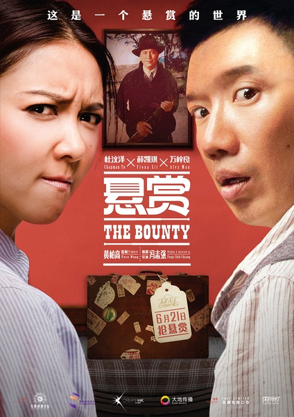
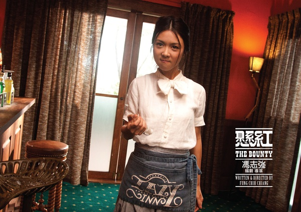
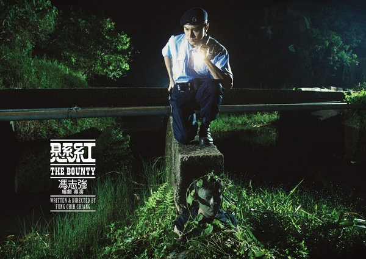

《悬赏》

			

老公的评论：
 
　　杜汶泽瘦了许多，真的是许多许多，让他看起来也舒服了许多。
 

　　就这部电影本身而言，如果不是非要把结尾“上升”到一个“很高”的高度的话，其实是一部相当不错的电影。特别是电影的前半部分，虽然有些荒诞，有些不合逻辑，但是却吸引我一直想知道结果是什么，我个人认为这就是一部电影的魅力所在。
 
　　其实，很难给这样一部电影定性，说它是喜剧？罪案？打斗？悬疑？伦理……，说实话，这就是我喜爱的港剧。
 

　　为什么最后非要把钱给那个新娘呢？助人为乐是对的，但是故事中的阿曹凭本身赚钱也没什可被指责的啊？很奇怪的感觉？还有一点，就是故事中的村民大多在帮助椰子佬也让我有些不明白，这些人真的有是非观吗？为什么女主人公能够帮助通缉犯，罔顾法律，却又有很高的道德标准呢？也许这些问题都是非理性因素造成的，但我觉得正是这些非理性才构成了人。人本身就是非理性的生物，否则理性的概念恐怕就会被“正常”素代替了。
 
　　希望以后好的港片可以少一些道德教育，多一些真正的娱乐色彩吧！

老婆的评论：
 
　　真觉得杜汶泽瘦了很多，有点不同。万梓良不再是帅哥了。
 

　　这是一个悬赏的世界，坏人都有一个价，所以当赏金猎人是一个不错的工作。但这次杜汶泽演的阿曹似乎找错工作了。帮人找到狗，可一分钱没收到，再找个价值40万的坏人，可死了，一份钱没收到，意外的两个坏人因为悬赏来追杀他时，得到了赏金，又要因为孙朗清（薛凯琪饰）要求帮助一个人。
 
　　我想这部电影想传递一种正义无价价值观，可又塑造了孙朗清想包庇坏人这么个状态，矛盾了。
 
　　整体来说还是好看的，台词什么的还挺逗的。　

上映年份　2012							
		
http://blog.sina.com.cn/s/blog_52187ba90101g2uz.html
