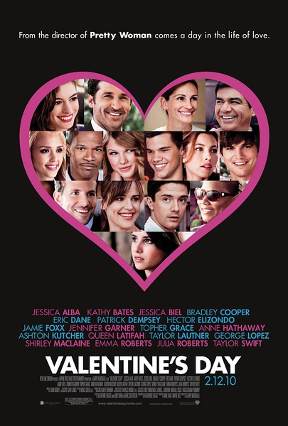
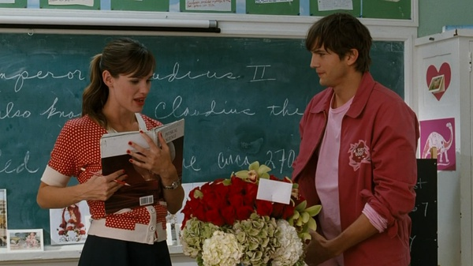
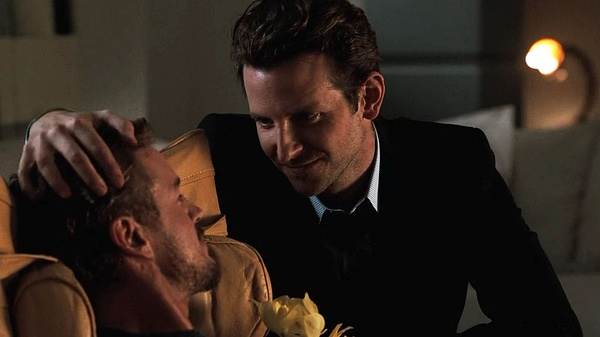
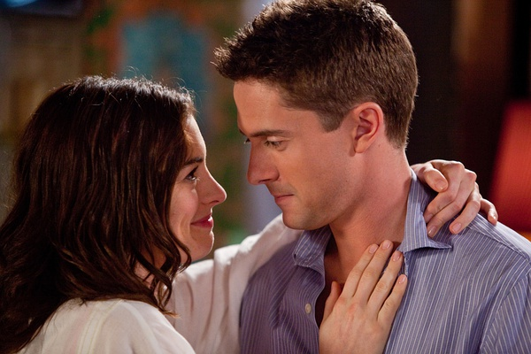

《情人节 Valentine's Day》

			

老公的评论
 
　　众多明星汇聚一部电影，剧情较为碎片化，谈不上浪漫，但是还算温情吧。
 
　　花店老板还不错，刚看过他主演的《杀手们》，算是有比较深刻的印象，但是其他人没有给我留下什么印象。
 

　　我想编剧和导演是想描述这样一个场景吧——情人节是特殊的一天，也是平常的一天，在这一天之中有人快乐，有人悲伤，有人从快乐到悲伤，也有人从悲伤到快乐，有人恋爱、有人失恋；有人和情人在一起，有人和亲人在一起，还有很多人和不认识的人在一起……
 

　　就像模仿秀里面的人总是喜欢模仿有特点的人一样，平凡或者是平常二字是最难模仿，最难表现的。《情人节》想表现的就是一种“平常”，表现的很好。我们本来就生活在平常之中，只是我们每个人都试图在平常之中需找自己的非常罢了。
 

　　关于电影中“娶了自己最好的朋友”这个话题，让我想起了周慧敏的《爱当真》中的一句歌词“做你朋友知己和情人”——或许这就是最快乐的婚姻生活吧！

老婆的评论：

 

　　要说这部电影我能坚持下来也够奇怪的，主线不清晰，出场人物太多了，剧情也很混乱。但看到这么多的熟人在一部电影里，怎么的也要支持一下啊！
 
　　情人节，很特别的节日，那一天有多少人感到幸福快乐，有多少人心碎。至于这部电影的影评，我真觉得没什么可写的。
 

　　额，最大的乐趣是在于等着下一个出场的人，是不是在哪里见过？我一直想不起这部影片中那个爷爷，我总觉得我看过他演的片子，在网上也没查出来，令人郁闷。还有，昨天刚看完杰西卡·贝尔演的《全面回忆》，今天又见到她并被我一次认出，很神奇！顺便说一下喜欢阿什顿·库彻，因为他演的《杀手们》！
 

                                 大概是因为他帅吧，发他一张图片

 安妮·海瑟薇显老了

认出你了，杰西卡·贝尔！
　　
上映年份 2010							
		
http://blog.sina.com.cn/s/blog_52187ba9010183ni.html
