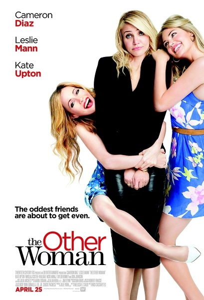

《情敌复仇战 The Other Woman》

			

老公的评论：
 
　　只看片名和开头，本来还以为这是一部关于两个女人抢老公（男友）的电影，结果却很惊喜，呵呵，确实是让我们很惊讶的喜剧。
 
　　我不知道是什么人把这部电影归入爱情喜剧范畴里的——这部电影跟爱情有关系吗？
 

　　在婚外恋如此“泛滥”的今天，《情敌复仇战》用它独特的视角和表现方式诠释了“冒险的代价”，最后，男主人公撞碎玻璃房的一幕把“因果关系”推向了顶峰。
 

　　整部戏有一个男主角和两个女主角、一个女配角，我个人觉得扮演妻子的莱斯利·曼恩实在是表演的太有喜剧效果了，想不笑都不行。
 
　　另外，我觉得我应该记住的是编剧的名字Melissa Stack，能编出这种电影的编剧一定不是凡人。
 
　　在生活压力越来越大的今天，看这种轻松的影视作品，真的很享受！

老婆的评论：
 

　　要是天下的女人都有这种格调，那么这些已经有出轨的男人们，日子也没有想象的那么好过额。我看男主公马克也挺倒霉的，遇到一个认真的女友卡莉，居然跑到他们家来，更是让自己的妻子凯特遇上了。
 

　　其实我一开始挺不喜欢凯特老去纠结卡莉的，怎么的也是马克的问题，骗了卡莉说自己未婚，没想到凯特的纠缠，凯特的疯狂和无助，最终让卡莉与凯特变成了好朋友了，很快她们发现在她们之外，马克还另有别的女人。
 

　　当然了，那个漂亮的女人艾伯，也加入了报复马克的三人复仇小组，她们折腾马克，脱发水，拉肚子的药，最关键的是把马克骗来的钱拿到手，这一切进行的让看戏的人觉得爽啊！
 
　　马克暴走的潜台词，是不是我一定会回来报仇的？
 
　　可惜结局是这三位女人过的非常的好！　

原配、小三和小四一起与马克谈判的场景，最后马克暴走

当凯特原谅马克时，没想到后面还有背叛吧？！
上映年份 2014							
		
http://blog.sina.com.cn/s/blog_52187ba90102vbna.html
