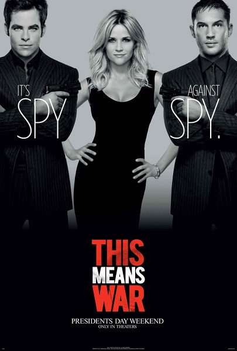
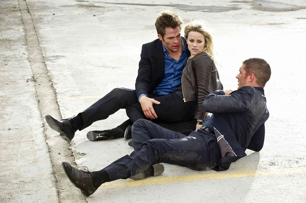
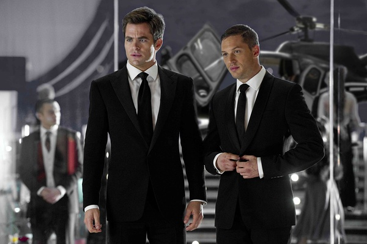

《情敌大战 This Means War》

			

老公的评论：

 

　　除了美剧《超市特工》之外，这部电影是我觉得最不像CIA的CIA剧情了，一部爱情片，被加入了许多搞笑的元素，真的挺有趣的。
 

　　看这部电影让我感觉又回到了金·凯瑞的时代，我其实一直是很喜欢这些闹而不俗的影视作品的，不闹就不够开心，俗了会让人恶心。
 

　　这部片子的开头很酷，结尾恶搞，其实只从这两个部分来说，已经值得一看了，中间部分的剧情虽然有一些老桥段的翻新，但是整个时间线和紧凑，并没有什么浪费，每一处细节也都做的很合理，只是主人公两兄弟的那场餐厅大战有些过了，显得有些特权主义横行的样子。
 
　　FDR的外形很帅，希望以后能多看到他的作品。

老婆的评论：
 
　　这部影片真的很好看，好久都没看过一部这么搞笑的电影了。
 
　　两个好朋友追一个女孩的故事你或许看过，觉得没什么新意，但是塔克（汤姆·哈迪 Tom Hardy 饰）和FDR（克里斯·派恩
Chris Pine 饰）这两个特工搭档兼好朋友用特工的方式追女孩萝拉（瑞茜·威瑟斯彭 Reese Witherspoon
饰）的故事却不容错过，两兄弟为了赢得萝拉的爱情使出了各种手段，收集萝拉的情报，监视萝拉的动向，然后为萝拉量身定做出追求方案，还要破坏对方的约会，毫无疑问是一场大闹剧，这次战争无论谁输谁赢都给观众制造出很多的快乐。
 

　　我和老公还觉得萝拉到头来谁都不会选，可没想到她选了FDR，还要结婚，还好塔克与他的前妻又似乎重新开始了，算是很完美的结局。本来就这么结局不是挺好的吗，导演在结尾时让FDR道出曾经与塔克的妻子有过一夜情，哈哈！这两兄弟又该斗上一阵子了吧！

上映年份：2012							
		
http://blog.sina.com.cn/s/blog_52187ba9010127zo.html
