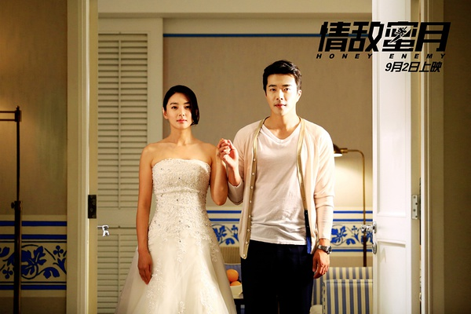

《情敌蜜月》

			

老公的评论：

　　相当不错的一部电影，虽然在一些局部细节上面还难免恶俗，但是整体的感觉很到位。

　　第一点想说的是张雨绮的声音实在是不怎么好听，这部电影应该没有用配音吧，要是配音就不会用这种声音了。

　　第二点想说的是霍建华真的不像二十多岁的人，要是像故事中说的他们从大学开始谈了快十年恋爱，这个男的得复读了多少年啊！权相佑还是有点味道的，但我很好奇在语言不通的前提下，演员怎么入戏？感觉真的有点牵强，为了广告吗？

　　第三点要说的，是这个片名是怎么起的，“情敌”我认同，“蜜月”何来呢？

　　最后一点，我觉得结尾略微有点牵强，如果不安排这种看似“圆满”的结局，我觉得从现实的角度来说才最“圆满”！

老婆的评论：

　　夏小雨（张雨绮饰）是一个工作狂，因为这样导致她和许默（霍建华饰）的分手，这让她很沮丧。忽然领导周云枫（权相佑饰）想请她做她最出色的事情——婚配，在知道其婚配的对象叶静斯（施予斐饰）居然是许默将要结婚的对象时，她答应了。

　　故事就在这四个人的互动中展开了，有小甜蜜，有忧愁，有茫然，我想夏小雨最多的感觉可能是不甘心，不愿意承认这段相处这么久的恋人娶得却是别人。

　　其实这部电影也很简单，人物也少，可在看这部电影时，就不会不喜欢，结局也是喜剧，夏小雨在最后部分想通了，她还帮许默把叶静斯给追回来了，自己也勇敢的跨出了另一步，和周云枫在一起。　
上映年份　2015

							
		
http://blog.sina.com.cn/s/blog_52187ba90102wfgn.html
