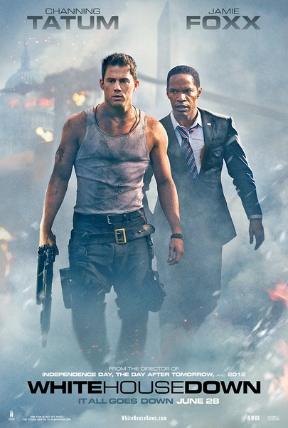
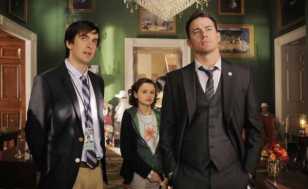
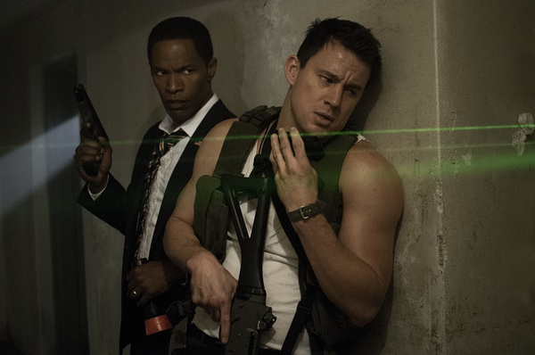

《惊天危机 White House Down》

			

老公的评论：
 

　　比起刚刚看过的《奥林匹斯陷落》，我觉得这部《惊天危机》要更好看一些，虽然这两部电影讲的都是白宫被恐怖分子占领，但是在我看来，《惊天危机》更适合我的欣赏角度，特别是最后小女孩挥舞大旗的那一幕，让我甚至都有了感动的感觉。
 

　　都有叛徒出现，都有专业能力很强的恐怖分子，都有副总统级别的人物演反派，都是孤胆英雄独立拯救美国总统……，很像的创意，却一点也不像的剧情！
 

　　说起来，我喜欢看巴特勒的电影是超过塔图姆的，但是，这部电影中，塔图姆的表现非常出色，非常恰如其分地表演出了一个美国英雄的感觉。
 

　　很多很多辉煌的成就都是靠细节来积累的，《惊天危机》中有一个细节让我非常注意，就是特勤局老大的妻子当听说他的老公是为了给儿子报仇才占领白宫的时候，就说他做什么都是对的——这一点虽然很“反传统”，但是却增加了一份意外的真实感。
 
　　觉得塔图姆还会再红一些，他的年龄还不大，有机会，加油吧，希望看到更多他的好电影。

老婆的评论：
 

　　我是觉得这次白宫沦陷，比上次来的有创意，这次完成是内部开始，看来这种事情没有内应是绝对不能实施的。这次攻陷白宫有复仇，有威胁勒索和利益驱使三方力量组成。
 
　　看到艾米丽挥动旗子时，我很激动，虽然只是影片，但很有鼓舞人心的意义。
 

　　以一抵众在美国电影里是屡见不鲜，这种英雄式的角色是本片的主人公凯尔，他为了解救总统和救女儿出去真是豁出去。加上白宫导游、艾米丽、总统索亚其他一些有点性格的角色，本片的人物塑造的不错。
 
　　整体上来说，这是一部好看的电影。

上映年份　2013							
		
http://blog.sina.com.cn/s/blog_52187ba90101g2uv.html
