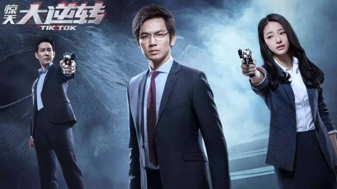
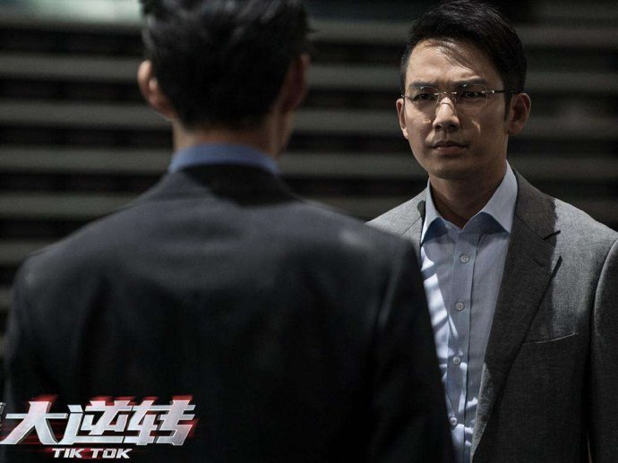
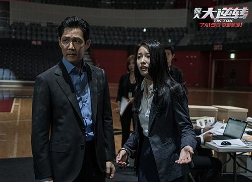

《惊天大逆转》

			

老公的评论：

　　看过之后，觉得《惊天大逆转》还算是中国编剧导演的一部不错的影片啦。故事没有明显的漏洞，一切虽然起伏但都在清理之中，而且以我们看过那么多美剧、电影的角度来说，这部《惊天大逆转》并没有什么太明显的抄袭的痕迹。

　　和老婆大人讨论了电影的内容，她认为自己很不明白为什么故事中女心理医生的建议那么重要，以至于韩国警方要听她的；在我看来，电影中的韩国警方的整体智商是一方面，而另一方面则在于钟汉良扮演的奸角的策略，实际上在整部电影之中，那位女法医所给出的建议没有一次是正确，她以为自己有很强的逻辑思维能力，但是实际上她只是反派利用的棋子。

　　在给老婆大人的解释中，我认为按照剧中“弟弟”的设计，即便不是这个女心理医生，也会有别的心理医生出现以供其利用的，这个心理医生出现的目的就是一次一次地误导警方，她以为自己自主思维做出的判断其实都是陷入别人心理陷阱的结果。

　　很少看国内的电影，更少看韩国电影，所以除了对钟汉良略微知道一点外，这部电影的其他角色一概不认识。这样也不会让我因为个人感情而对影片产生太多的不理性的好恶心理。

　　未必会是大卖的那种电影，但是细细品味，真的还不错。

老婆的评论：

　　虽然我想说这部电影的一些细节上处理的不好，但这部电影设计出来的悬念还是不错的。

　　在看电影的时候，我对这对兄弟做过设想，比如是哥俩一起设计的，比如在精神病医生那的不是哥哥是弟弟，他们故意混淆视线。但我没想到的是除了第一次是哥哥郭志达，剩下事情都是由弟弟郭志华（钟汉良饰）一人自导自演的，他利用心理医生杨曦（郎月婷饰）把警察骗的团团转，在这一点上真的非常厉害。

　　真因为这么厉害，我觉得编剧在结局那一段设计的又有点不太像郭志华那人的风格，是没有更好的结局？作为一个好智商的犯罪，他既然能想到从水里逃走，为什么就没有准备防水袋装黑钥匙呢？不合理。难道想说他太自负了？

　　我知道在大多数的影视作品中，坏人都是要得到惩罚的，所以无论如何郭志华是要被抓或者死的。

　　特工姜承俊（李政宰饰）在最后的时候还起到了作用的。

上映年份：2016							
		
http://blog.sina.com.cn/s/blog_52187ba90102x8pf.html
