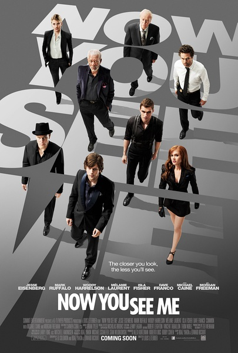

《惊天魔盗团》

			

老公的评论：
 
　　看到网上很多负面的评论，所以并没有在第一时间看这部电影，如今看来，也还可以。
 

　　我想，我能觉得这部电影好看，多半是因为我把它当做了一个“魔术电影”，看的是声光效果，看的是噱头，而没有太过关注情节的设计与完整性。
 

　　客观说来，整个故事被几乎完全孤立地分割成了三个部分，只不过主人公都是四骑士，追查的警探也是一拨人而已。感觉整体上的潦草，我认为是篇幅限制的原因，如果这个电影被改编成一个美剧，有更多时间来交代前因后果，应该会精彩很多，也会严谨的多。
 

　　侠盗是我们喜欢的题材，魔术也是我们爱看的表演，就冲这两项，这部电影我是不会给太多的负面评论的。记得之前看过的一部《致命魔术》，也很好看，希望以后能够看到这类题材的美剧。
 
　　说到魔术揭秘，还真看了不少这样的视频，也挺有趣的，但是拆穿了，也少了很多神秘感和乐趣。

老婆的评论：
 

　　看完以后，我一直和老公说，这部电影开始给我的感觉太震撼了，这已经超越了魔术了，而是魔法，搞不好还是黑魔法，是需要付出代价的，后来一点点的揭秘，这种神秘感也就消失了，这个结尾我也不太喜欢，即使是这样，我依然认为这是一部好电影。
 

　　从某种意义上来说，这部电影的剧情发展还是很有意思的，编剧是有水平的，能让我一直在跟着剧情在想，谁是四大骑士的内鬼？先猜黑人老头，过了好一段我猜是那个法国女警，最后我才往那个窝囊的FBI上想。这是不是算与观众产生共鸣？有互动是好事。
 
　　在这部电影里四骑士拷贝了一个巴黎银行这一场景，在看《11罗汉》里，也有。这出戏中，催眠术很重要。
 
　　结尾部分，其实我很高兴四骑士都好好的，那个死是一个局，没有遗憾。只是，最后场景是什么意思？……

上映年份　2013							
		
http://blog.sina.com.cn/s/blog_52187ba90101fuq8.html
