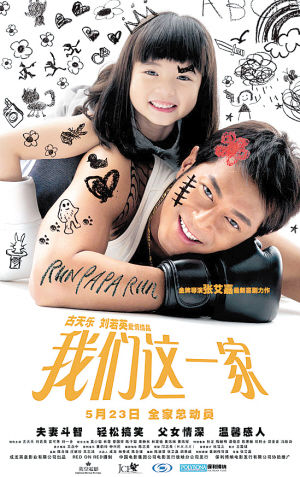
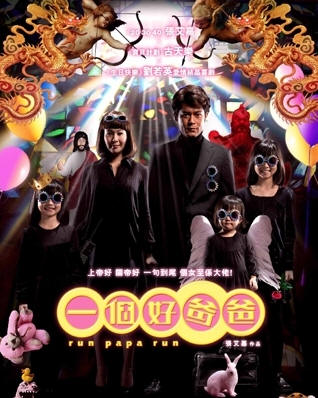

《我们一家人》

			【夫妻影评】《我们一家人》

 
老公的评论：
 

　　春节期间回父母家里，因为上网不大方便，所以选择了看电视，因此也在央六看到了这部电影，虽然感觉这是一部不适很新的电影，但是感觉很亲切。
 

　　我想，同样的一部电影，在不同的人看来可能感受也是不同的。看这样的老电影，特别是一个相对简单的剧情，我对电影本身的感触就没有老婆深，我想说的，有两个事情，第一是莫少聪，第二是因果关系。
 

　　好久没看到莫少聪演的电影或者连续剧了，没想到的事情是莫少聪居然给古天乐演小弟，感觉真的是沧海桑田，人间变幻啊。香港演员里面，我个人觉得最帅的有两个，第一是关礼杰，第二是莫少聪，但可能是“自古红颜多薄命”吧，帅哥总是无法取得大的成功。以前和刘德华、周星驰配戏的时候，莫少聪还算是个主角，但现在成了这样，我不知道在拍这样的电影的时候，他是什么样的心情……
 

　　我一直坚持着，不信报应，但相信因果。剧中的李天恩，演的很到位，很容易引起大家的同情，后来他想退出黑社会而无法退出，必须用诈死的方式才能活得自由，我觉得正是他之前的因，带来了最后的果。没道理说年轻的时候他想砍谁砍谁，等到想洗底的时候就可以轻易洗底，这不公平，所以，看这部电影的时候，我并没有什么同情他的地方。听说有一个版本的电影结尾是李天恩看到了自己的女儿出嫁，我觉得，这已经是一种奢侈的享受了。
 
　　可能我不够浪漫吧，太分清对错了，喜欢古天乐的朋友莫怪！
 

 
老婆的评论：
 

　　有段时间没看港剧了，无意中在中央六台看到这部影片，其实挺让人感动的。古天乐演的黑社会老大爸爸，为了女儿，在这一过程中一点一点的变化，很是温馨。
 

　　一直都在说，看港剧的最大好处，新片老片都能认出一大堆人来，而老片你就能看到现在很红演员在过去只是一个小配角，总是有各种角度让你得到一些意外。
 
　　这部电影我们就能看到莫少聪的影子，没想到他演古天乐的小弟而已。
 

　　其实这部影片最想让人说说的就是，古天乐为了女儿，把身上纹身的老虎变成一只卡通的小猫，开始穿西装，不再说脏话，为了不让女儿知道他是黑社会，他居然办起学校了，不再作奸犯科了，可怜天下父母心。一点一滴的他在转变，可惜怎么洗不掉他的过去，最后不得不接收社团的安排去接毒品，之后假死。
 
　　最终的结局古天乐在教堂祈祷能见上家人。其实我更喜欢这部影片的另一个名字《黑社会老爸》，感觉更贴切一些。
 
上映年份 2008
 
部分演员职员表
导演……张艾嘉
原著……李纯恩
李天恩……古天乐
李妻……刘若英
大眼……莫少聪
口水……林雪
　　							
		
http://blog.sina.com.cn/s/blog_52187ba90100gkkd.html
