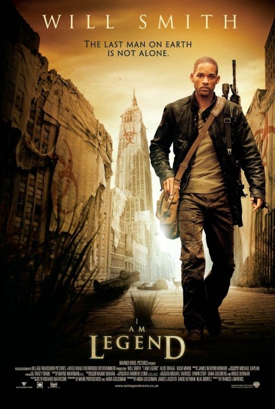
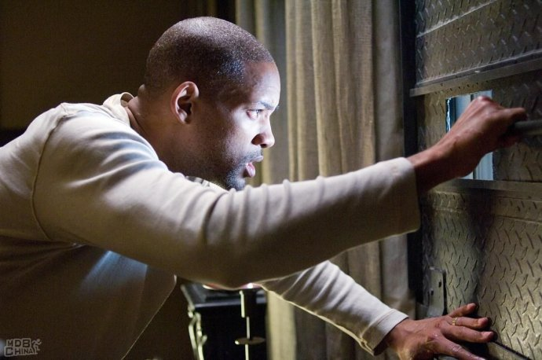

《我是传奇 I Am Legend》

			【夫妻影评】《我是传奇 I Am Legend》

 
老公的评论：
 
　　因为是威尔·史密斯的电影，所以没有什么太多的顾虑，看过之后，觉得还有让我们不大满意的地方。
 

　　没看懂为什么要安排变异人与人的这种对立，也没弄懂为什么要用legend这个词汇，我个人觉得这次用在这里多少有些不合我的逻辑。影片中设置的那个虚拟世界我是接受的，而有一部分人会对某些特定的病毒天生免疫我也是接受的，只是，我不知道主人公一天到晚在做什么，是要拯救世界，还是就这么在自己的恐惧中生活下去。
 

　　其实，我也没打看懂那个变异人对自己亲人的感情，不知道他为什么会因为另一个变异人而放弃了到口的食物，优胜劣汰，这是自然法则，当一种生物具有了压倒性的优势的时候，那么世界的规则就应当有他们掌握。而且，有这么凶残的生物存在，那些鹿啊，狮子什么的，怎么还能在城市里游荡呢，夜晚早就应该被吃掉了吧。
 

　　我也没看懂主人公拥有先进的高科技武器，为什么没有打到一只鹿，而是要靠罐头来维生，或者，有时间钓钓鱼也好啊，天天吃罐头，太没营养了吧。
 
　　看到主人公和那个女人还有小朋友一起开车走了，没想通路是从哪里来的，桥不是已经炸断了吗。
 

　　真的没看出来主人公是个传奇……，如果像我和老婆大人商量的那样，结局是主人公等发明了药物，可以治疗那些变异人，主人公成为了新的“上帝”，这才算传奇。
 

 
老婆的评论：
 

　　不管怎么样，我对这部电影的结局很不满意，如果说电影的本意是想突出主人公罗伯特是就是那一传奇的话，至少我认为结局罗伯特与女人孩子驾车去寻找幸存者，这种结局并没有突出罗伯特是传奇这一主题。我想结局要是改成罗伯特研究出治疗病毒的方法，那成是一个完美的结局。或许导演故意的……
 

　　用一种病毒去治疗疾病，却带来了全球性的毁灭。当罗伯特（威尔史密斯演）带着他的狗开着车在头追捕鹿群时，这种画面甚似凄凉，高楼依然再，汽车横竖的乱停在街道上，只是没再看见半个人影。这种镜头反复几次后，我和老公说道，就算人类被病毒打败了，也应该能看到不同的东西吧，我还以为是人已经变成这些摆放在各处的模特了。
 

　　终于追黑人出场了，罗伯特终于抓住一个追黑人做起研究，之后一些奇怪的事情发生了，罗伯特被这些追黑人算计了，他的狗死了，再出现了一女人一孩子。接着追黑人狂攻他家，救出了自己同伴后，放过他们了。而罗伯特他们去寻找其他的幸存者了。
 
　　要是那个罗伯特换成我或者你？你会怎么样？令人深思……
 
　　哦，还想说的是威尔史密斯相比他演的黑衣人，这部影片中的他显得没那么精神了。
 
 
上映年份2007
 
导演
Francis Lawrence
 
主演Robert……Will Smith
 							
		
http://blog.sina.com.cn/s/blog_52187ba90100kpze.html
