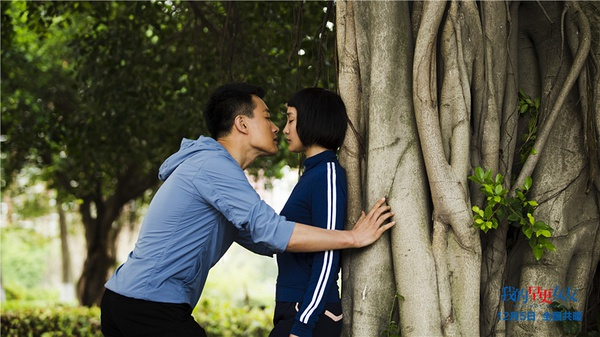
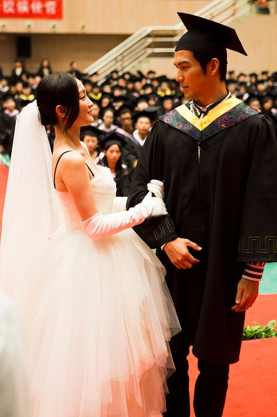

《我的早更女友》

			

老公的评论：

　　开始看一些国产电影，学习一下为什么如今国内的影视业如此璀璨。刚看完《撒娇女人最好命》，再来看这部《我的早更女友》，女主角都是周迅，情节都还算搞笑。

　　看这部电影的印象最深刻的部分是佟大为显得真年轻，如果说电影里的演员有谁长的真的像毕业了四五年的、不到三十岁的人的话，还只有佟大为合适，周迅还是显得老了点，另一位女配张梓琳则显得多少有些做作。
　　

　　关于这种搞笑电影的剧情，我觉得没什么太多评论的，反正就是东拉西凑一些网上的或者是老百姓口耳相传的笑话、故事给拧在一起，这部电影算是整合小笑话比较成功的，像穿婚纱参加毕业典礼啊、淡水龟往海里扔啊、水漫车身啊、扮新娘抢亲啊……，真的都是很流行的故事，真的算是整合的不错。

　　从个人喜好上来说，喜剧结尾总是我更喜欢的，喜剧同样可以很感人，那些靠悲剧、靠生死来感动观众的文艺作品不是不好，但是在好的影视里面是最下乘的，喜欢喜剧结尾，喜欢天下有情人终成眷属。

老婆的评论：

　　又看了一部周迅主演的电影，这次她演了一位因感情受挫而导致年纪轻轻就有更年期症状，有点失控的威嘉，还好她的同居男同学，那位暗恋她很久的男生袁晓鸥（佟大为饰），一直默默的照顾她，真是一个难得的好男人。

　　每个人都会有人生经历，感情在人的一生中，也是很重要的一个选择，威嘉太勇敢，在这么多人面前求婚不得，导致她后来的四年，过的很混沌。

　　结局还是不错的，还挺让感动的，终于威嘉能看见这份感情，而袁晓鸥也表达自己的心意，有情人终成眷属！

　　电影虽然不是很精彩，但也能看！　　　　

上映年份 2014							
		
http://blog.sina.com.cn/s/blog_52187ba90102vp4d.html
