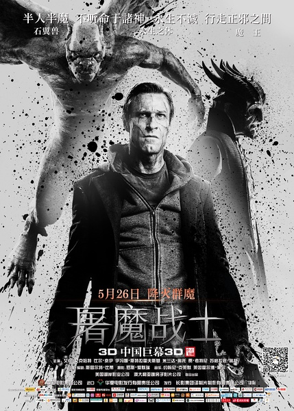
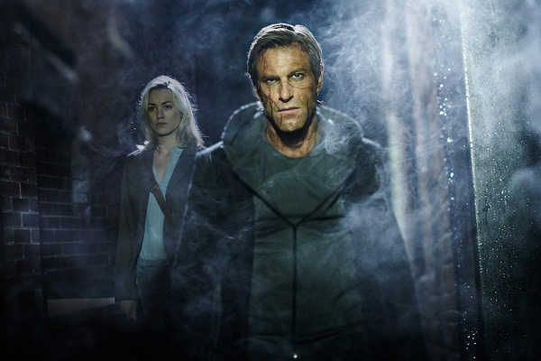
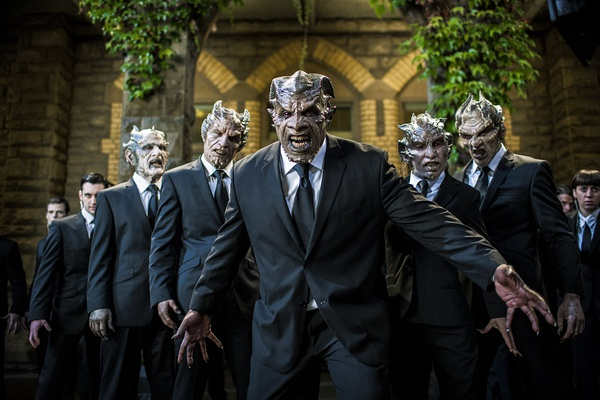
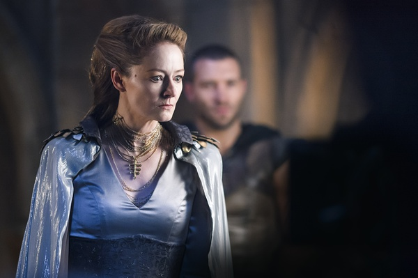

《我，弗兰肯斯坦 I,Frankenstein》

			

老公的评论：

　　一部相当好看的电影，不仅包含了我们两个都喜欢的灵异题材，而且把传说和现实结合在了一起，对了，还有一点就是看到个老熟人——Yvonne
Strahovski。

　　在我的意识之中，弗兰肯斯坦应该算是僵尸圈的老大吧？！这部电影从另一个角度讲述了科学怪人的故事，故事中的弗兰肯斯坦虽然依旧是一个拼接而成的人，但是他并不恐怖，而且越来越有人性，越来越像一个真正的人类。

　　电影中的暗夜神龙族很有意思，平时他们是建筑上的装饰，而到了关键时刻就变化成恶魔的克星……，从这点来看，原来西方建筑上的装饰和中国古代建筑上的装饰是没有区别的，都有辟邪、镇宅……的作用，有时间应该去了解一下这方面的文化。另外电影中暗夜神龙族怎么好像总透露着一点邪恶的气息？不知道有续集的话会不会弗兰肯斯坦还是要和他们大战一场？

　　Yvonne Strahovski在《超市特工
Chuck》中扮演了女主角，而《超市特工》是我们曾经非常喜欢的一部剧集，没想到又在这里见到“老朋友”，看电影看到这种熟人总是觉得很有趣。

　　这部电影是可以改编成剧集的，应该依旧很好看！

老婆的评论：

　　我喜欢这部电影，里面的夜行神龙族、恶魔及科学怪人亚当这些元素，我都比较喜欢。而这三方大战，让这个电影的内容更加丰富。

　　科学家弗兰肯斯坦用不同的尸体造出了科学怪人亚当，而又想杀了他，结果科学怪人把他的妻子杀了，而弗兰肯斯坦追杀亚当时，被冻死，留下了一本手札。

　　恶魔们对科学家弗兰肯斯坦复活尸体的科学怪人亚当感兴趣，一直要捕获亚当来研究，夜行神龙族曾救过亚当一次，进过200年，亚当厌倦了被追捕，决定寻找恶魔的头目纳贝流士王子。

　　亚当无意中发现了，恶魔储存尸体的基地，遇到了科学家特拉，识破了恶魔的意图，他引着夜行神龙族到恶魔基地，一场大战，救出了特拉烧毁了恶魔基地，杀了纳贝流士王子。而亚当发现他其实是有灵魂的，也找了自己的使命，不再迷茫。

　　主演科学家特拉的伊冯娜·斯特拉霍夫斯基我们比较熟，看过她主演的《超市特工》。

恶魔们

夜行神龙族
上映年份 2014							
		
http://blog.sina.com.cn/s/blog_52187ba90102vtbf.html
