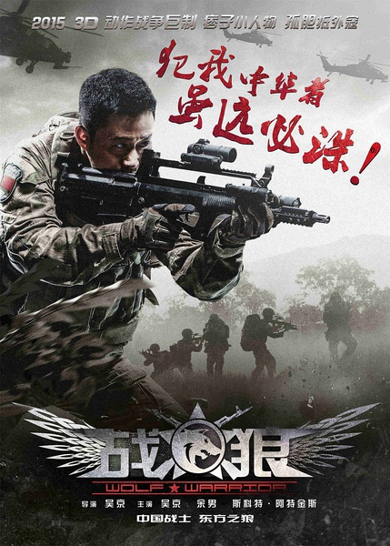
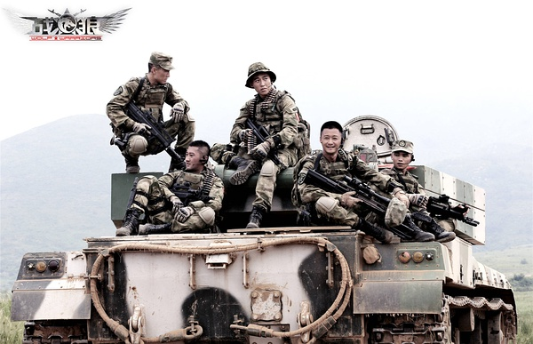
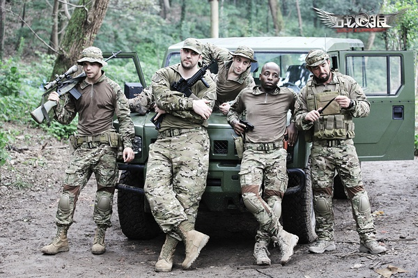

《战狼》

			

老公的评论：

　　很多年了，这是一部能让我觉得好看的国产电影，我觉得朝这种风格发展下去，中国的电影有希望。

　　说在前面，我很不喜欢吴京，在观看之前也没有关注过这部电影的票房，但是在看过之后，我觉得这部电影真的很不错，其原因有三。

　　第一，《战狼》整体节奏很紧凑，没有浪费的地方，虽然不像好莱坞大片那样刺激，但是一气呵成，让我在看电影的时候不会有坐立不安的感觉；第二，《战狼》中并没有很牵强很刻意的场景、剧情、对白，让我不会在看的时候不会冒出“太假了吧”的想法；第三，犯我中华，虽远必诛——这句口号太响亮了，既包含了传统文化中的概念，又坚定有力，我觉得社会中应该传递的就是这种正能量。

　　故事的结尾并没有落入俗套，男主和女主是不是会在一起，并没有给出一个必然的答案，让观众自己猜去吧，挺好；而男主如何躲开那个地雷的，变成了一个“秘密”，这种“不合理”在适当的条件下变成了一种“合理”的解释，也挺不错。

　　原来枪战、特种兵题材的国产电影也可以拍的这么好！加油，中国电影！

老婆的评论：

　　国产电影能拍成这样已经非常的不错了。很打，有的对话很幽默。颇有美式英雄的味道。

　　情节很简单，冷锋（吴京饰）是特种部队的狙击手，在一次任务中，他没有听从指挥枪杀了暴徒武吉（周晓鸥饰），被处罚，但又因为他非常厉害，被特种部队狼队的中队长龙小云（余男饰）招到自己麾下。

　　特种部队的演戏中，冷锋逐渐表现出他出色的观察能力。

　　另一方面武吉的哥哥敏登派出来了雇佣兵来追杀冷锋，其实这一点我觉得听不靠谱的，就算是雇佣军，也不至于往我特种部队里来追杀某一个战士，那还能回去？

　　当然敏登还有更复杂的意图，就是让雇佣军探出一条道路，带着生化武器去往其他的国家，复仇只是为了掩盖这一意图。

余男

上映年份 2015							
		
http://blog.sina.com.cn/s/blog_52187ba90102vrh7.html
