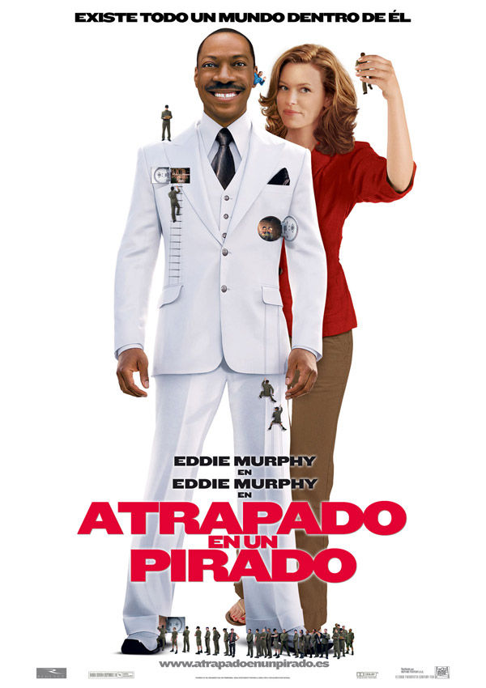
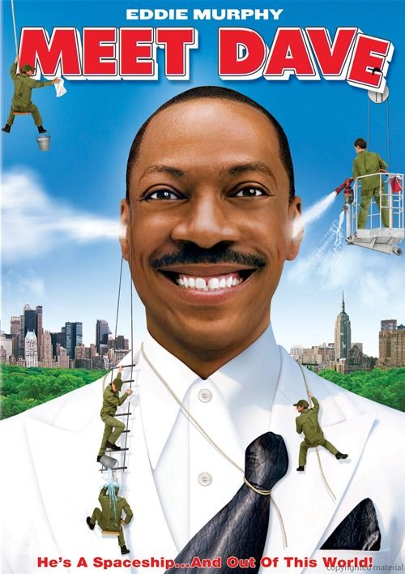

《戴夫号飞船 Meet Dave》

			

老公的评论：
 

　　看到原来大个的墨菲是艘飞船的时候，还是有一点点惊喜的，一开始并没有想到“戴夫号飞船”是这个意思，剧情解释了之后，觉得有点创意。
 

　　关于外星人的故事已经有很多很多很多了，这个故事虽然轻松，但是新意还是有一些的。最有趣的一点就是原来某种外星人比我们的手指都还要小，但是他们的科技却比我们先进了很多，这个是合理的，谁先到达另一个星球，就说明科技要高一些。
 
　　地球上的警察为什么那么多事呢，抓一个外星人可是很危险的，更何况是一艘飞船了。
 
　　飞船上的4号是个看点，本来看他一脸严肃，很像一个军人的，但是没想到他是最前卫，最摇滚的一个。
 
　　电影是娱乐大众的，但是这部电影也讲述了一个真理——爱，可以改变一切。

老婆的评论：
 

　　有一段时间不看电影了，总觉得电影没有电视剧那么精彩，看评论这部电影的票房不太好，不过我觉得这部电影挺搞笑，还有人说这部电影适合20岁以下的人观看，那这种影片也适合我，简单又搞笑，多好！
 
　　一艘飞船居然只有人这么大，外星飞船由戴夫船长带领一群小外星人来到地球上找能源拯救自己星球的故事。
 

　　能源球掉到一个小朋友家，戴夫船长决定用友善的方式去取回能源球，小朋友的妈妈吉娜刚好又撞过戴夫，与小朋友一家的相处让戴夫感觉到了人类的情感，飞船上的2号并不喜欢这样，而3号因为吃醋以为戴夫喜欢上吉娜，帮助2号夺取了戴夫的船长之职，并使用武力对待人类，并把能源球扔进了大海吸收水，关键时候戴夫与3号表白清楚，夺回了飞船，收回了能源球，坐着那只鞋离开了地球。
 

上映年份 2008							
		
http://blog.sina.com.cn/s/blog_52187ba9010181kn.html
