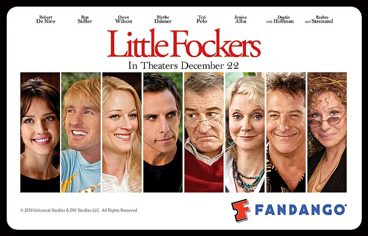
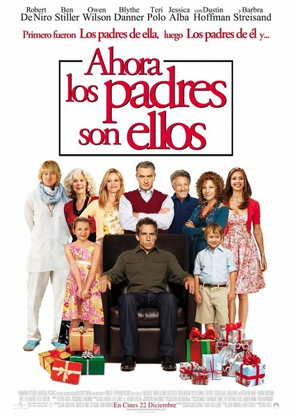
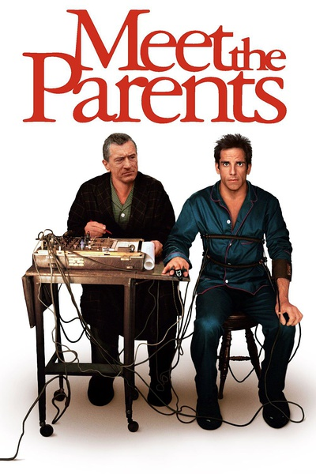

《拜见岳父大人 1-3》

			

老公的评论
 
　　其实第一部和第二部很久以前就看过了，这次为了看第三部又把之前的两部找来重温了一下。
 

　　我觉得把这些拍摄于不同年代系列电影放到一起看是一件很有趣的事情，让我们可以在很短的时间里看到一个演员老去的变化，真的很有意思。
 
　　从如今，也就是2013年的我们的眼光来看，这三部系列电影有点像，一鼓作气，再而衰，三而竭。
 

　　虽然第一部拍摄于13年前，但是看起来却更流畅一些，第二部的拿“性”作为调侃的话题，小朋友讲脏话，以及第三部的“充气房拳击赛”都显得笑料的水准不够高，不够自然。
 
　　本·斯蒂勒是我最喜欢的笑星之一，可他的作品水准实在是有些良莠不齐。
 

　　说点正面的话，我觉得《拜见岳父大人》三部曲整体给人的感觉还是很温馨的，虽然有些地方夸张过了头，但是其实还是反映了一些家庭问题，在我看来，父母对待子女，在有些时候是完全一样，不论是东方文化还是西方文化，无论是中国还是美国。

老婆的评论：
 

　　其实这三部曲，之前看过2个了，只是太长时间给忘了，为了看3，再一次看前两部时，竟然没有什么印象了。相对来说前2部要比第三部更搞笑些。
 

　　第一部是关于主人公格雷戈要去见女友潘米拉的父母，并要得到他们的认可，好向潘米拉求婚。来到未来的岳父杰克家，这个退役的老特工对待格雷戈并不友善，格雷戈又特别的想证明自己，而闹出的差点烧了房子，把潘米拉妹妹的婚礼彩排搞的一团糟等等一系列故事。第二部是潘米拉父母要和格雷戈父母见面商量婚期，而格雷戈的父母非常的有特点，让杰克有点难接受，格雷戈要怎么样才能化解这些呢？真的花了很多心思，最终把婚结了。第三部是格雷戈和潘米拉婚后的生活，给双胞胎孩子过生日，家长们都来了，这下热闹了，杰克又会弄出系列事情。
 

　　总体上来说，这三部曲拍的很温馨！在看的时候，老公与我设计将来我们家孩子的另一半来见我们是一个什么样的场景？哈哈！想想都有意思，不过，我想还是悠着点的好吧。
 
　　听老公说这三部曲拍摄时间差了十年，是啊，在这些主人公们的身上看到了不同了。

上映年份 第一部 2000
        
第二部 2004
        
第三部 2010							
		
http://blog.sina.com.cn/s/blog_52187ba901019vpk.html
