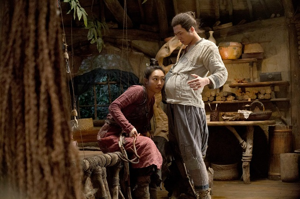
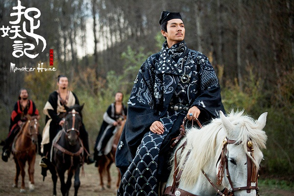
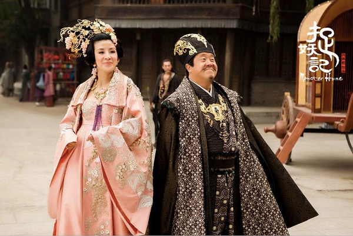

《捉妖记》

			

老公的评论：

　　就我个人而言，觉得如果一百分是满分的话，这部片子可以达到八十分左右，也就是还没到优秀的高度。

　　需要承认的是，这部电影的剧情简单易懂，怪物形象憨萌，情节不是很拖沓，对于传统的国产电影而言，看得出这部《捉妖记》实在进行一些尝试……，比如中间怪物和罗刚对唱的那段……，有趣，但是还不够好。

　　从编剧的角度来看，我觉得这个故事的设计其实挺好的，人族和怪物族互相伤害导致了战争，但是实际上大家是可以和平地相处，这一点很有看点。

　　电影因为要搞笑，所以把太多的情节安排到了一个故事当中，有爱、有恨、有情……，组合还不错啦。不过最可爱的还是“萝卜”。

　　对了，这个故事还有无间道的情节，原来葛老板就是新的怪物国王，这也算是偶然当中的必然了。

　　在看片头的时候，觉得这部电影很像美剧《异形庇护所》，挺不错的，值得一看。

老婆的评论：

　　人和妖可以共存吗？其实我觉得在没有绝对利益的冲突下，是可以的，就和人与动物一样，不是也共存着嘛。唯一的区别就在于妖比动物要聪明很多，可还不是一样被抓妖人杀了。

　　很奇怪的是，要吃妖的葛千户（钟汉良饰）是妖。这样看妖也有聪明的。居然懂得用抓妖人去排除异己，厉害。

　　要是我得了胡巴那样的小妖王，一定不舍得放弃他，多好的小家伙。还能当机关枪使。呵呵。

　　至于故事的情节，就没有什么好说的了，事情发生的还可以，那个村子里的人都是妖变的，让我觉得有意思。

　　演员的话，白百何、井柏然都是第一次看他们演的片子，给我的感觉还行吧。　　

新妖王还是很狡猾的

上映年份　2015							
		
http://blog.sina.com.cn/s/blog_52187ba90102w3s0.html
