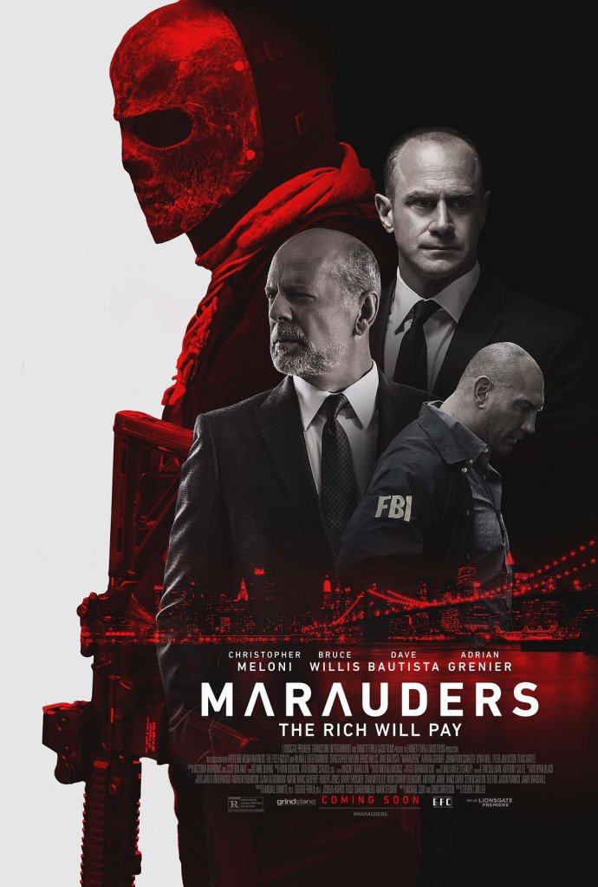
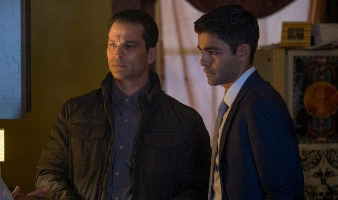
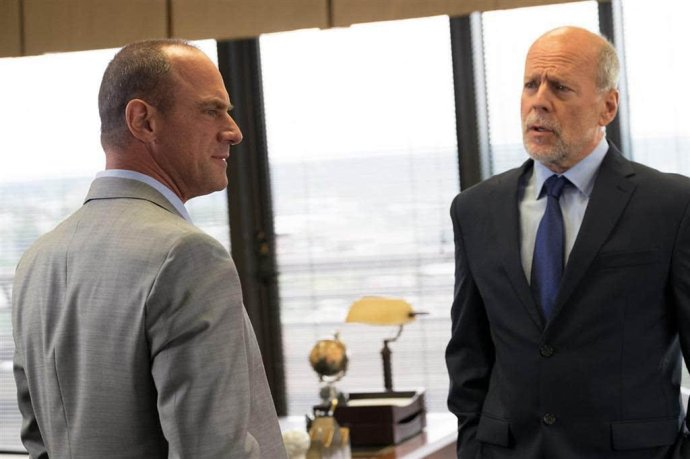
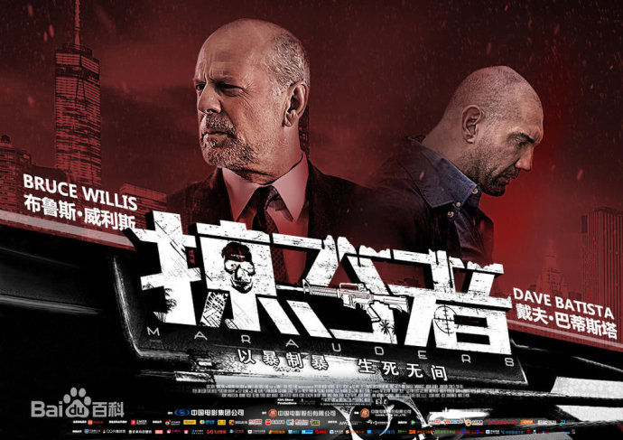

《掠夺者 Marauders》

			

老公的评论：

　　虽然这是一部枪战动作片，但是实际上考研观众的却不是感官，而是思维分析能力。

　　我们不妨先来讨论一下结尾：一心破案的FBI为什么放着银行劫匪不抓，反而冒着生命危险去血腥地刺杀一位富翁银行家？

　　我认为这部电影实际上讲的是“道德与法律”的关系，西方人是基本没有“德治”的，他们认为约束社会行为的是法律，站在法律的角度，威利斯扮演的银行家是无罪的，但是站在道德的层面上，银行家为了独霸家产，利用伪造的信息害死了包含他的弟弟在内的一拨无辜大学生，他是该受到道德的谴责的；反向同理，银行劫匪们肯定是触犯了法律的，但是他们一方面是在为自己的良心赎罪，另一方面则是想让银行家的罪行被揭穿，只是他们确实也杀了一些无辜的保安……

　　那位辛辛那提的“黑警”米姆斯也是一样，法律层面并没有证据去制裁他，但是站在道德的层面，他的良心终于发现了，而他也付出了代价。

　　影片结束前FBI和特种兵的对话很值得回味，虽然特种兵并没有接受法律的制裁，但是他的良心会一直受到谴责。

　　“法制”是一种强制性的手段，而“德治”才是人类作为智能生物的终极目标，至少，我，是这么认为的。

老婆的评论：

　　这部电影刚看完时，我真的没搞明白，里面什么是什么，看的我稀里糊涂的。因为里面人物关系太复杂，真不适合我那个简单的小脑瓜。
　　
　　关于剧情和老公聊了聊，我才给理顺。

　　正义是什么？我想就本片的那几个主人公都有不同的认识。法律是什么？如果做错的事情的人，逃过了法律的制裁，那么要来惩罚做错事情的人的行为，叫不叫正义？期间产生的附件伤害是不是违背了他本人的意愿？

　　本来我以为本片FBI的威尔斯（艾德里安·格尼尔饰）刚开始抢休伯特（布鲁斯·威利斯饰）的银行，本心真的是为了引起警方的注意让休伯特做过错误的事情得到应有的惩罚，可慢慢的发展，事情真的失控了。

　　还有那个黑警在这部电影中出现是为了什么？是要引起人们对正义和道德的更深入的思考吗？或者是做错事虽然没被抓，也会得到惩罚？

　　另外，在墨西哥为什么蒙哥马利（克里斯托弗·米洛尼饰）非要自己杀死休伯特？还放走了威尔斯呢？这已经超过了他警察的职责了。看来他也觉得法律制裁不了休伯特，他要代为执法。
　

上映年份：2016							
		
http://blog.sina.com.cn/s/blog_52187ba90102x8pv.html
