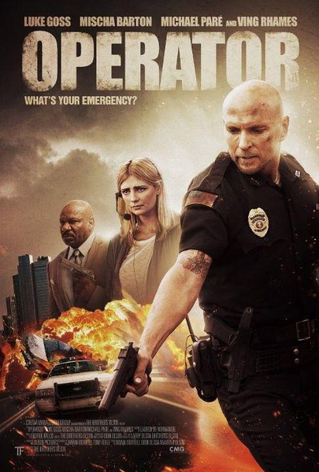

《接线员 Operator》

			

老公的评论：

　　鲁克·高斯还是挺有型的，在《死亡飞车2》中他给我留下了深刻的印象，这部电影中，他扮演的警察依旧很酷。

　　《接线员》从整体上来说还是一部很好的电影，节奏快，情节紧张激烈，故事有一定的逻辑，可看。不过因为看过太多的西方影视作品，我觉得这部电影虽然不能算是差，但是总好像缺少点了什么。

　　电影中有一个情节我一直没有想明白：到底警官杰瑞米的死活和整个犯罪过程到底有没有关联？是不是罪犯团伙从一开始就希望杰瑞米死掉？因为那个杰瑞米能够在那个厢式货车撞击下死里逃生不能不说有意外的成分。

　　在厢式货车之后，我们俩开始怀疑杰瑞米的搭档就是罪犯之一了，当时，我还希望编剧能够在超越一下，明明把这个角色演的很像坏蛋，其实不是，这才算反转，但是编剧还是没有策划一次更惊艳的剧情，杰瑞米的搭档和帕米拉的主管果然都不是好人。

　　在看这部电影的时候，我一直在想，这部电影如果拍成没够美剧罪案剧中的一集，会不会因为时间缩短了而显得情节更精彩呢？

老婆的评论：

　　我似乎看过类似这样的电影，可惜已经不记得了，也是操纵了911呼叫中心接线员进行抢劫，这部电影更过分的是用其女儿操纵了接线员帕梅拉，并且还带上了她分居的丈夫杰瑞米，真是一家子都跟着受罪。

　　在我看来，这部电影还是不错的，至少这部电影整个逻辑性很强，最后的反击也很有力，大概是他们错误的估计了杰瑞米的能力了，导致最后的失败，当然，这也是因为电影必须这么完成，主人公毕竟是帕梅拉夫妇，还必须给大家塑造正义必胜的信念。

　　我没有想到这个犯罪分子这么敢想敢干，一口气抢劫了很多家银行，我和老公猜到了呼叫中心的领导是坏人，杰瑞米的搭档是坏人，但怎么也没想到，那个控制她的人就在他们的办公室。而这个人，要帕梅拉认下所有的罪行，真的很厉害，连替罪羊都找好了。

上映年份 2015							
		
http://blog.sina.com.cn/s/blog_52187ba90102wnqg.html
