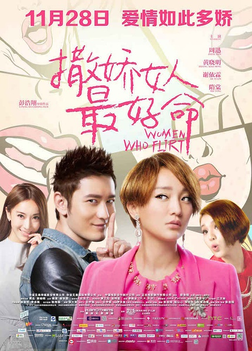
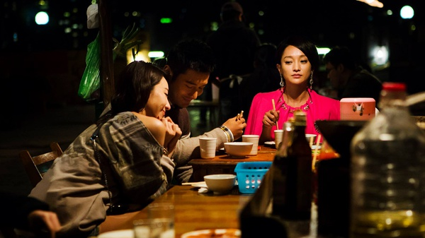
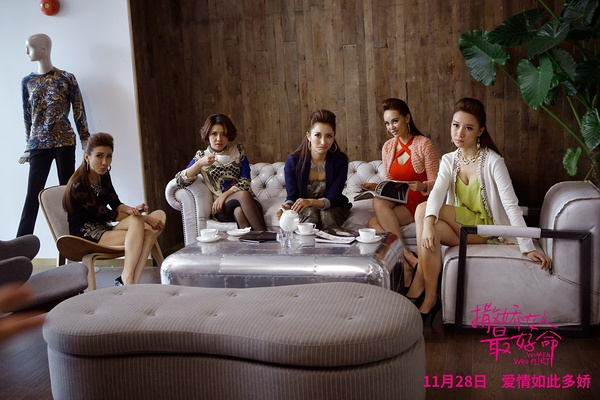

《撒娇女人最好命》

			

老公的评论：

　　觉得确实有好笑的地方，但是并不觉得这是一部很好的电影，当然这只是我的个人喜好问题，一部能卖座的电影总是有它成功的道理的。

　　看了这部电影之后，知道现在社会上流行言辞说法的出处，我觉得现在的年轻人学习这样的电影中的台词，和我们这些70后当初（也包括现在）喜欢学周星驰电影中的台词和桥段是一样的，只不过时代不同了，人们的偶像也不同了。

　　观影之后，我感觉到了自己和时代的距离，这样的电影能够受到欢迎，说明现在的年轻人喜欢的是直白，不喜欢含蓄，喜欢的是装，不喜欢的是真——这一点真的很矛盾，也许这些年轻人到了最后，发现自己喜欢的又是一种非常真的“真实”。

　　很多在我看来很做作、很假的对白、场景都出现在了这部电影里，因为这部电影受欢迎，我只能觉得是我的问题，如果我还想走在时代的前沿，而我又无法引领时尚的话，我就必须追逐时尚的脚步。

　　积极的一面儿，是让我似乎明白了一些年轻人的生活态度与生活方式，如果我想要让自己活得年轻一些的话，就应该去按照真正的年轻的节奏去走，而不是自己认为的年轻。

　　如果要挑点硬伤的话，就是周迅在这部电影里有点显老了……，我对周迅的记忆，还停留在非典时期央视每天长播的《射雕英雄传》里。

老婆的评论：

　　到后来我看的还挺乐的。刚开始的我是忍着看下去的，大概是开头很无聊吧。不过，一个这么简单的故事，能演成这样已经不错了。

　　龚志强（黄晓明饰）和张慧（周迅饰）是好友，但张慧其实是喜欢龚志强的，而龚志强一直觉得两人是好兄弟，无意中认识蓓蓓，这两人开始谈恋爱，让张慧非常有危机感，决定听从好友的建议，学好撒娇，对付撒娇精蓓蓓抢回
龚志强。

　　“其实我是一个同性恋”，是吗？虽然张慧胸平点，也不是男人啊，这种细节我觉得还能处理的更好一些。

上映年份 2014							
		
http://blog.sina.com.cn/s/blog_52187ba90102volz.html
