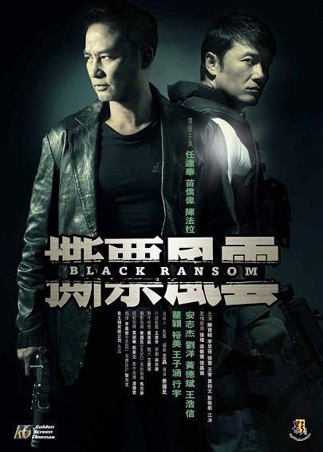

《撕票风云》

			

老公的评论：
 
　　又是一部很不错的港片，加上最近看过的《全城戒备》，难道港片真的复兴了！？
 

　　和《全城戒备》一样，这部片子也让我误会了一下，以为是一部关于绑票的电影，结果很出我的意料，原来绑人的人是“地下法官”，而被绑的人都是黑社会的老大，这个题材，还是挺有新意的。
 
　　片头也狠狠地把我给误导了一下，明明看到苗侨伟扮演的角色是飞虎队的打扮，谁知道一转眼就变成了绑匪，很唬人。
 

　　任达华还是不显老，而且以他的年纪，演这种“人老成精”的角色还是很有味道的，他在罪案现场闭着眼睛描述细节的那场戏很不错，很是超越以前的港片了。苗侨伟现在又逐渐红了起来，电影、电视剧又经常出现了他的面容，他假扮警察踢人的那个场景很酷。
 

　　这个片子的美中不足是结尾部分略显仓促，阿森是一个那么出色高智商人物，怎么就那么容易上当呢？苗侨伟的形象就是给我这种感觉——即使他演的是奸角，但也希望他有好的下场。
 
　　真的很不错，有些意外，有些惊喜，有些余味……
 
老婆的评论：
 

　　最近看的两部港片都还不错，这部除了有熟悉的演员苗侨伟、任达华、安志杰、黄德斌，让我没想到是在这里看到陈法拉和王浩信，整部影片的节奏把握的也好，看着不会让人很烦躁，也没让我睡着。
 

　　这部影片我觉得苗侨伟演的那个阿森更像一个地下法官，前警察变坏了威力更大了，他一方面了解警方，另一方面了解黑社会，所以很少有对手，直到遇到任达华演的张博文，也遇到黄德斌演的那个黑社会老大冰哥。
 

　　影片结尾部分有点仓促，苗侨伟带着狙击手打警察这块，我是觉得安排的不是很合理，一方面苗侨伟这个组织是为了对付坏人的，他们不需要对警察打开杀戒的，另一方面苗侨伟是领导他叫手下走，手下不听他的也不对。在交换人质时，我觉得这块也不太合理，都不看看人就让她过来，结果很惨！
 
　　看这部影片我得到一个结论，就是人不要为了追星不折手段，不然连命都保不住。
 
上映年份
2010							
		
http://blog.sina.com.cn/s/blog_52187ba90100ufl9.html
