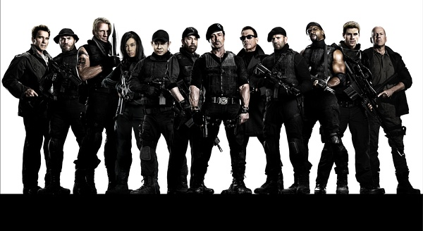

《敢死队2 The Expendables II》

			

老公的评论
 
　　片子的风格显得老旧一些，但是节奏很快，不用多想，很过瘾。
 

　　不对，还是多想了一下，就是桑族在杀死比利的时候，为什么不把圣诞这一伙儿人都给杀了，虽然导演是要留着这些人报仇，但是显得尚格·云顿那票人有些太狂态傻了。
 
　　相比第一部，施瓦辛格和威利斯的戏多了很多，挺有意思的，特别是施瓦辛格把车门拽下来的时候，而且他那句“I'll be
back”实在是显得太有意思了。
 

　　这些巨星，在最当红的时候，有一个就足以带动票房了，所以他们在之前同台演出的场景几乎没有，现在都老了，也终于有了合作的机会，让我这个年纪的影迷除了感叹还是要感叹一下的。
 

　　在我个人看来，这个片子可以有第三部的，只是要再多一些创意，很期待这些伴随我从十几岁直到三十几岁成长的影星们能够多留下一些精彩的作品与震撼的荧屏形象。

老婆的评论：
 

　　这部电影真简单，就是打，使劲的打，打的过瘾，只是有些遗憾岁月在那些大腕们的脸上留下了太多的痕迹，用他们自己的话说同那家飞机一样老了，都可以进博物馆了。
 

　　还有什么比复仇作为这部影片的主题更好？当然没有！复仇是一个好的主题，因为这些敢死队的主人公们都不是善茬，也因为坏人有点太坏，也有点笨，你要杀人就一并都给杀了多好，就当着人家队友把比利给杀了，这个仇不报怎么行呢？
 
　　这样的影片，还是看吧，享受的就是这种很打的视觉感，没什么可说的了。

上映年份 2012							
		
http://blog.sina.com.cn/s/blog_52187ba901019soa.html
