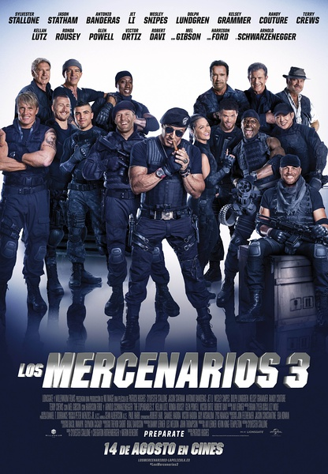
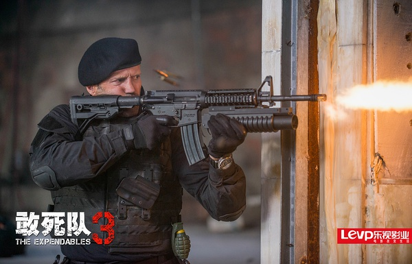
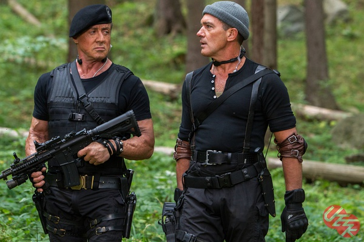
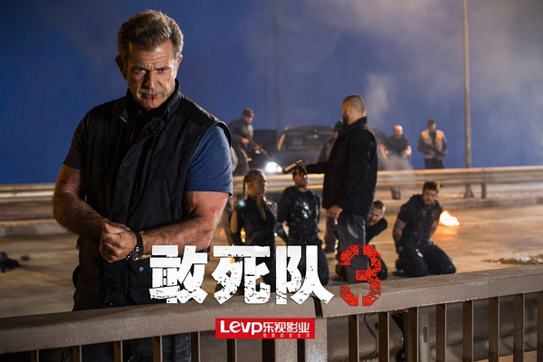

《敢死队3 The Expendables 3》

			

老公的评论：
 
　　看这部电影的第一个感觉是“这个社会真的进入老龄化了”！
 

　　史泰龙（1946）68岁，斯坦森（1967）47岁，吉布森（1956）58岁，李连杰（1963）51岁，班德拉斯（1960）54岁，斯奈普斯（1962）52岁，龙格尔（1957）57岁，福特（1942）72岁，施瓦辛格（1947）67岁……，在片子公映的2014年，连最年轻的斯坦森也已经快“知天命”了。想想看，在史泰龙刚开始拍《洛奇》的时候，老婆大人还没有出生——世界真的变得太快了。
 

　　如果，我们在日常生活中看到一位老人家快七十岁了，是什么感觉？会不会有我们看到电影中“巴尼”的感觉？难道荧幕中的形象果然年轻一点吗？史泰龙和吉布森两个老头对打，依然显得力量十足，在感叹电影特效的同时，也不得不向这样的老人家致敬。
 
　　电影中，既拍出了“姜还是老的辣”，同时也演绎出了年轻人的激情，虽然是个从头打到尾的爆米花电影，但是真的挺好看的。
 

　　看到史泰龙一个一个地凑着那些老一辈的动作明星，觉得他不是在拍电影，而是在写一部美国动作电影的“史书”，有一种壮观的感觉！
 

　　期待《敢死队4》再度出击，让我们看到更多的能给我们带来回忆的明星们，但是也可以接受《敢死队》系列戛然而止，或许这样才有余音绕梁的感觉。

 
老婆的评论：
 
　　像这种影片，我觉得基本上写不出什么评论。因为剧情简单，也因为人物不需要特别的刻画，更只需要欣赏激励的对抗。
 
　　终于，这般老家伙们为了让剧情有些变化，加了好几个年轻人，把今年流行的跑酷元素加进来了。
 

　　不过我没想明白为什么康拉德·斯通班克最后要跑出来，他完全可以在幕后玩的，这么多的部队也没把这几个人干掉，只能说，谁叫他们是主人公呢！看着到比较过瘾。

有没有比右边的家伙更唠叨的人？

奇怪他为什么最后一定要跑出来，答案是：送死，好结束电影！

　　
上映年份 2014							
		
http://blog.sina.com.cn/s/blog_52187ba90102vbnd.html
