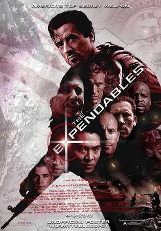
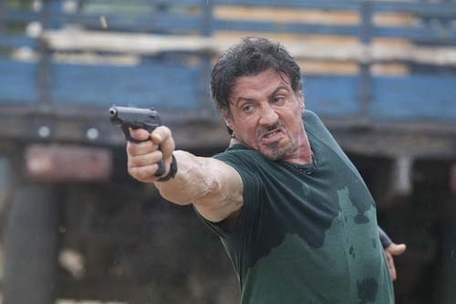

《敢死队 The Expendables》

			【夫妻影评】《敢死队 The Expendables》

 
老公的评论：
 

　　在那个年代的影星里，我是非常喜欢史泰龙拍的电影的，超过了喜欢施瓦辛格，所以，这部片子是绝对不能错过，更何况这部电影里还有我绝对不能错过的斯坦森。
 
　　对于整部片子，我反而没有什么好评价的，因为是动作片，够刺激，够精彩就好了，没必要说太多。
 

　　我想说的，是电影中那个史泰龙、施瓦辛格、布鲁斯·威利斯出现在一个画面中的场景，真的很震撼，很难说出那种微妙的感觉。三个老人家，史泰龙虽然一身肌肉，但脸庞已经有了老态；施瓦辛格可能是在政府工作久了，沧桑了许多，威利斯的皱纹也多了很多，但他们三个在一起……
 

　　我不是一个追星族，从来都不是，但我想，如果我能处在当时那个环境的话，我一定会要求在拿三个巨星的画面中出现，甚至可以是不惜一切代价……
 

　　时光是无情的，对所有的哪怕多么辉煌的人也是一样，时光不会回头，我们再也看不到年轻的他们，我们的年纪也在增长，叫别人叔叔到做了别人的叔叔，甚至是伯父，或许我喜欢的不再是这三位巨星，不是我眼前的他们，而是看到了20年前他们的样子。
 
　　还有更多的人值得我们如此怀念他们的艺术作品吗？
 

老婆的评论：
 
　　这么多巨星聚在一起已经是一件难得的事情。里面还有我最喜欢的斯坦森，李连杰。看这部影片的感受用“解气”来形容比较合适。
 
　　这部电影主要用看的，视觉感官得到享受就好了，之前在网络上看大家对这部影片的评论各不一，我个人觉得这部影片非常好看。
 

　　喜欢史泰龙演的这些角色，狠！他和斯坦森去岛上勘探时，被敌人发现，疯狂逃走后，开着飞机扭头回来对着这些人一顿狂扫，真解气。是我喜欢的风格！
 

　　这部影片我还有一个喜欢的，就是结局，他们去救了Sandra，解决了当地的这些恶势力，大家都全身而退没有牺牲的。要是为了救一个人而牺牲了队友，这种感觉也不是特别好！
 
 
上映年份2010
　　
　　							
		
http://blog.sina.com.cn/s/blog_52187ba90100nicq.html
