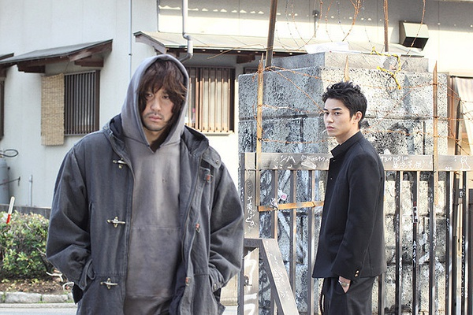
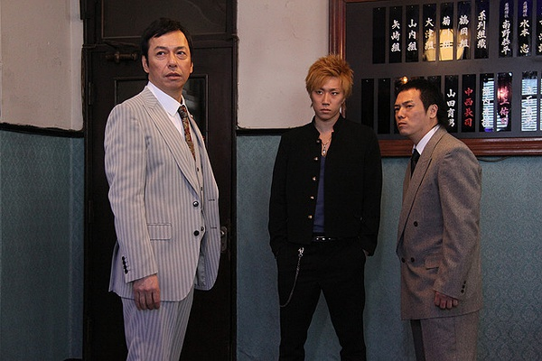

《新热血高校 Crows Explode》

			

老公的评论：

　　实话实说，第三部没有前两部好看了。

　　我爱看这个系列的电影，主要就是因为里面有足够多的“耍酷”的场景，而且酷到了顶点，可惜这第三部太想要强调人性，太想要树立正面的形象了，所以感觉上差了很多。

　　我觉得很多文艺作品都犯了这样的错误：太想做大而全，反而失去了最有特色，最有差异化的那部分。

　　在这个系列中，我并不喜欢“片桐拳”这个角色，理由呢，就是他太不酷了。而这部《新热血高校》里面的藤原也让我不是很喜欢，怎么看这个小子都不像是一个耍酷的帅哥吧，他的小胡子为他向下拉了很多分。

　　这部电影中给我留下最深刻印象的其实不是两个主人公，而是那个叫“黑色炸药”的小子，太酷了，“强罗”这个角色也不错。

　　如果再拍续作的话，我希望还是回到前两部的感觉，不用讲那么多励志的内容。对了，再拍下一步，林田惠就要毕业了吧，呵呵，那么登上铃兰之巅的人要挑战谁呢？

老婆的评论：

　　相对1和2来说，3拍的就不怎么的了，至少没有那么酷了，所以，我觉得这部电影可看可不看。

　　铃兰高中已经不一样了，连教室都不需要了，课桌和凳子都堆在那，大家好像也不需要上学了，那为什么还要去学校呢？好奇怪！

　　去铃兰高中到底来体会到什么？片桐拳要加贺美辽平去体会，胜利者的名字能登上铃兰高中最高处？是和小伙伴们最后一起克服困难的决心？其实作为我来说，我很庆幸我没有去那样的学校，感觉很可怕。

　　其实要是拍铃兰高中和黑咲工业高中两个学校对抗也有意思，但又非要把片桐拳这些扯进来，感觉在剧情上有点散。

　　镝木旋风雄和加贺美辽平的战斗，终将两个人的心结都打开了，这好像也是一件好事额，对两人以后的人生或许有帮助，而最后镝木旋风雄与帽子男林田惠的战斗谁赢了？似乎已经不重要了。

最后的这场架到底谁赢了呢？

其实这两个老人家的故事有点多余了

上映年份 2014							
		
http://blog.sina.com.cn/s/blog_52187ba90102vcxn.html
