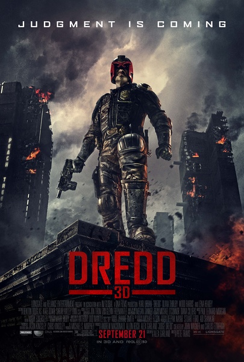
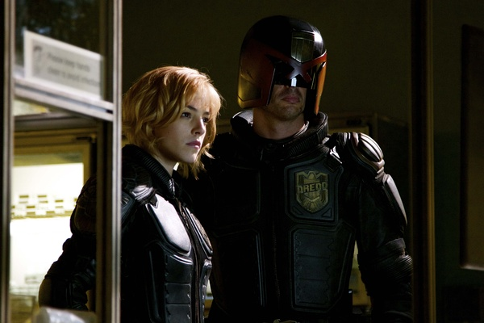

《新特警判官 Dredd》

			

老公的评论
 
　　感觉这部《新特警判官》和刚刚看过的《飓风营救》有一点和像——主人公对反派毫不手软——这点很过瘾。
 

　　因为年代太久远，对史泰龙所演出的《特警判官》已经毫无印象了，感觉和这部电影的内容也不怎么一样，那个时候还没发拍出这样的科幻效果吧。
 

　　电影中营造一个核战后的世界，这点并没有什么特殊的，好像很多末世电影都用的这样的题材，吸引我的，是男女主人公，两位特警判官被困在了大楼之后，那一瞬间，我能想象到后面的过程绝对不是主人公的困兽犹斗，而是一场属于主人公的大屠杀。
 
　　这个电影最有趣的一点是主人公自始至终都没有露出庐山真面目，够酷！
 
　　女主角显得文弱了一些，确实像是特警考试怎么都无法及格的人，哈哈！

老婆的评论：
 

　　这部电影来的精彩，看的我很过瘾，但当我看完，想想其实这部电影很简单，两个特警被关在一座城市里与一个帮派展开的战争。
　　
　　腐败好像什么时候都有，在这样的一个城市，特警的权利真的很大，既审判又是陪审团再是法官，当他们腐败时，非常的可怕，还好最终坏特警的下场就是死。
 
　　这次的毒品“慢时间”，感觉上还挺有意思的，吸完身边的一切都像在放慢镜头似地。　
 

　　还有电影的男主人公到头来，我都没见过他的脸，这也是一种与众不同吧。再有女主人公能够读取人思想这情节，在这部电影里用的不错。

这个反派MA-MA也很狠，可惜比起Dredd还差那么点。
上映年份 2012							
		
http://blog.sina.com.cn/s/blog_52187ba901019wiw.html
