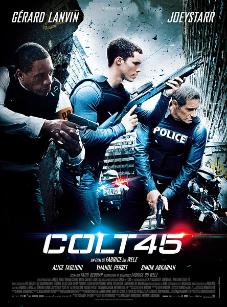
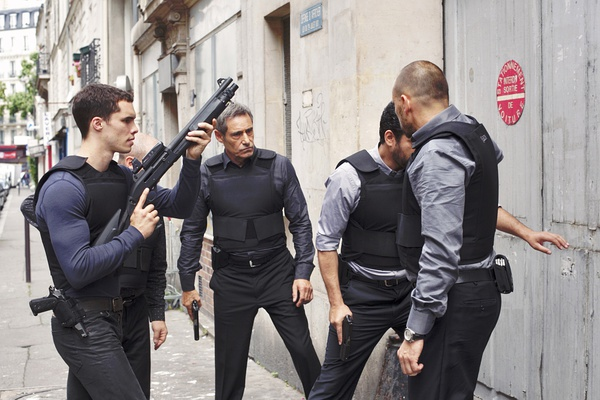
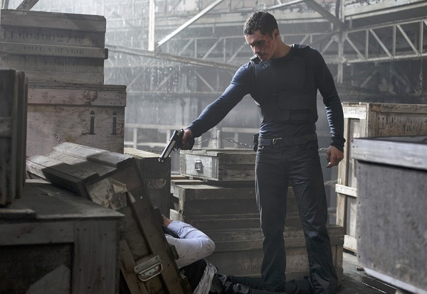

《无敌双环枪 Colt.45》

			

老公的评论：
 

　　说一句导演不爱听的话：我觉得这部电影最精彩的是结尾，因为它给了我无限畅想的自由，我真的觉得这部电影可以被改编为一部很好很好的电视连续剧。
 

　　影片的最后并没有显示出主人公到底接受或拒绝了那份特赦令，但即使他接受了，难道他不想为自己最亲近的人复仇吗？换句话说，那个秘密特工组织发展到了这个地步，已经和恐怖组织没有差别了，就算好一点，也是暂时停留在了“黑吃黑”的阶段，可是，如果那些黑帮都被他们抢完了呢？
 

　　一直有美国影视作品在讲CIA一直通过贩毒……等手段来充实经费，如今法国电影拍类似的情节，看来这些西方国家做这种事情是很有群众基础的啊！呵呵！
 

　　从情节来看，这部电影并不是真正意义的动作片，因为无论是打斗还有枪战都算不上激烈，真正激烈斗争的是心灵，期待这个基础上的美剧出现！
 
　　最后的疑问是，主人公的手机怎么这么旧，难道欧洲现在还生活在这样的手机时代？

老婆的评论：

 

　　匹夫无罪怀璧其罪，说的就是本片的主人公文森·米莱斯，一个没有野心的人，居然有这么好的枪法还被很多人知道了，居然还会造成那么厉害的子弹，不被人算计才真是奇怪了。
 

　　不知道文森·米莱斯最后的选择是什么？会留在监狱还是去当黑暗的使者，其实那种选择都不是很好，但两者相比较而言，可能黑暗使者就更具有诱惑力，比监狱里自由不说，更貌似挺正义的，毕竟是去抢和去杀为了反恐，给了多么有说法力的理由。
 

　　个人觉得从更深远来说，国家培养这种黑暗力量，游走出法律之外，应该不算什么好事吧。但我时常在想，我们国家应该组织一个盗窃团伙，去把当年被各国掠夺走的宝物偷回来。你看，这是多么矛盾的心理。
 
　　整体来说，这部电影只能算将将能看，剧情很平稳。

上映年份　2014							
		
http://blog.sina.com.cn/s/blog_52187ba90102w67r.html
