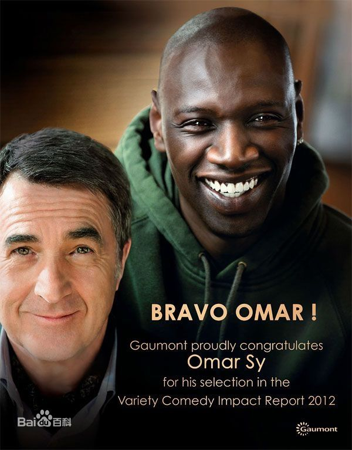
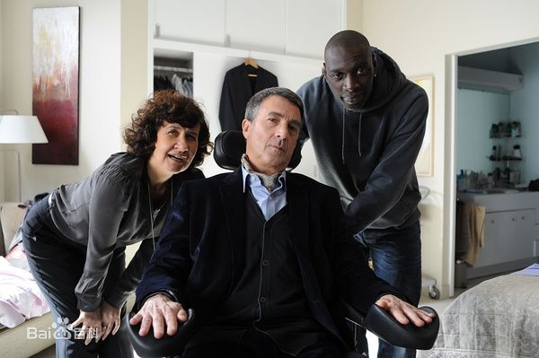
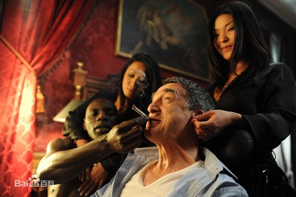

《无法触碰 Intouchables》

			

老公评论：

　　尽管内心很主观地抵制法国电影，但是这部《无法触碰》还是真的挺不错的，很温馨，在整个观看的过程中，不会觉得无聊，虽然整部电影有两个小时的时间，但是不会不耐烦地经常看表。

　　觉得这部电影很棒的第一个原因，是瘫痪的主人公菲利普并不需要别人的怜悯，这一点电影表现的很好。事实上，对于一个有缺陷的人，想要保持平和的心态是很难的。对于正常人来说，自卑都会是一种时常出现的情绪，更不要说菲利普这样除了颈部以上全都无法活动的人了。但是，不卑不亢，这位演员（弗朗索瓦·克鲁塞）诠释的非常到位——对于很多的事情，他是有感触的，但是基本都可以用乐观的心态去对待，太难得了。

　　“积极”两个字，有点太虚伪了。但是“乐观”却非常重要，我不可能最有钱、最帅、最……，但我真的希望我能够成为世界上最开心的那个人，我和老婆大人组成的家庭也是世界上最开心的家庭。

　　文艺作品总是要靠矛盾、冲突来掀动剧情的，《无法触碰》用的就是高雅富翁与贫民窟黑人的反差，不过，有一点必须要说：这部电影中的两个主人公都是善良的，这是一种幸运的吧，毕竟不是每个我们遇到的人都是善良的人。当然，也不是每个人都是邪恶的，但是在这个世界当中，大家的私心都太重了。

　　对于这样一部剧情片，我不想做太多剧透了，我觉得那种想追求心灵上的平和、宁静的人不妨看看　这部电影。

　　这部电影的场景虽然发生在现实世界，但是它所描述出来的感觉，却是人们内心深处那片最纯洁的童话仙境。

老婆的评论：

　　这是我第二次看法国的影片，很喜欢抒情，爱看文艺片的朋友可以看看法国片。

　　这部电影其实挺好看的，很温馨慢慢的讲述了一个残疾人士菲利普与他的男护工德瑞斯之间发生的故事，而这电影是一个真实的故事改编而成的。

　　本片告诉不要去玩跳伞太危险，变成菲利普那样，要是没有他这么多钱，还是别活了。就他这样生活也少了很多的乐趣啊。

　　大部分人看着菲利普时，不管他多少钱，那也会很同情他的，因为他是很严重的残疾人士。德瑞斯的出现，带给了菲利普不一样的感觉，他像照顾朋友那般，带着菲利普尝试过正常人的生活。

　　最后还帮他去见女笔友，据说他们还结婚了，还有了孩子，真的很感人。

　　弗朗索瓦·克鲁塞主演这部电影应该受了点罪，除了脑袋其他的地方都不能动，一定会不舒服。

上映年份 2011							
		
http://blog.sina.com.cn/s/blog_52187ba90102vh62.html
